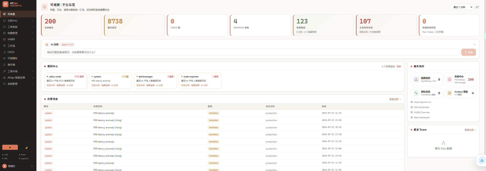
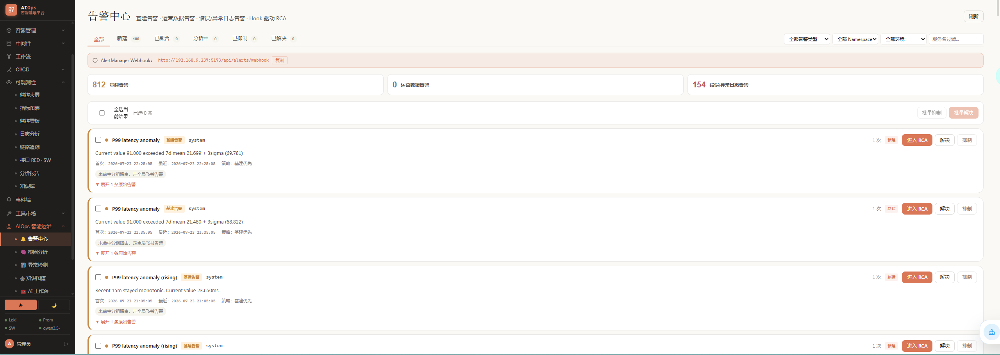
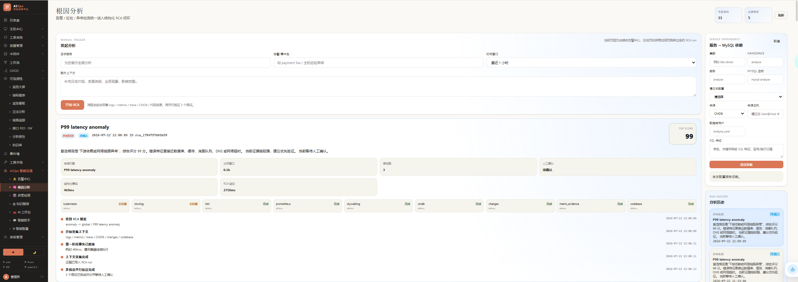
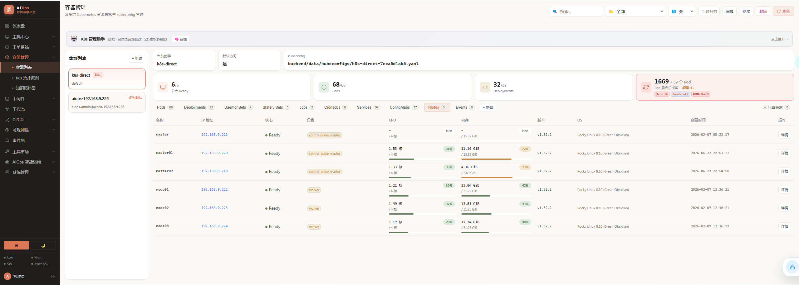
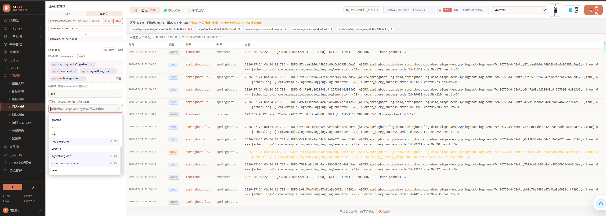
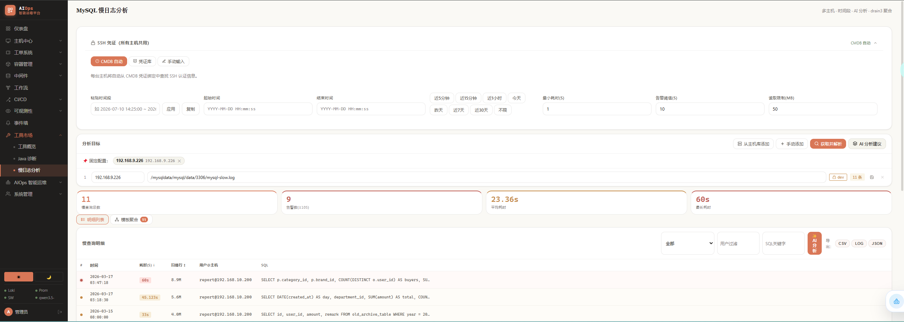
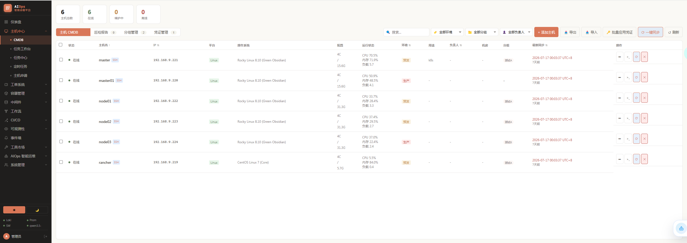
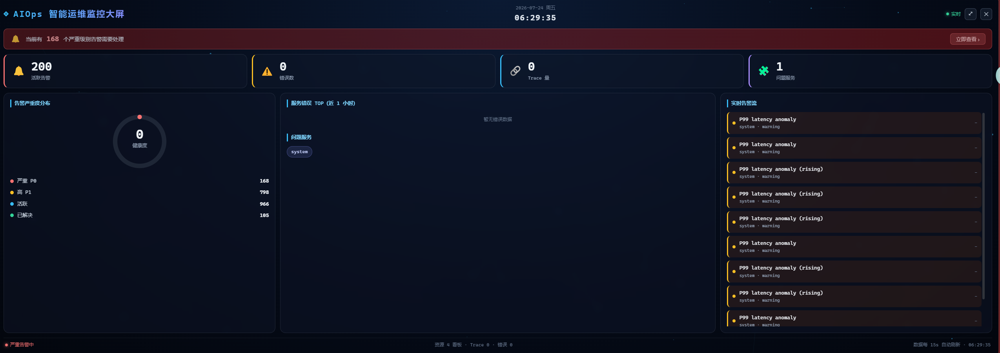
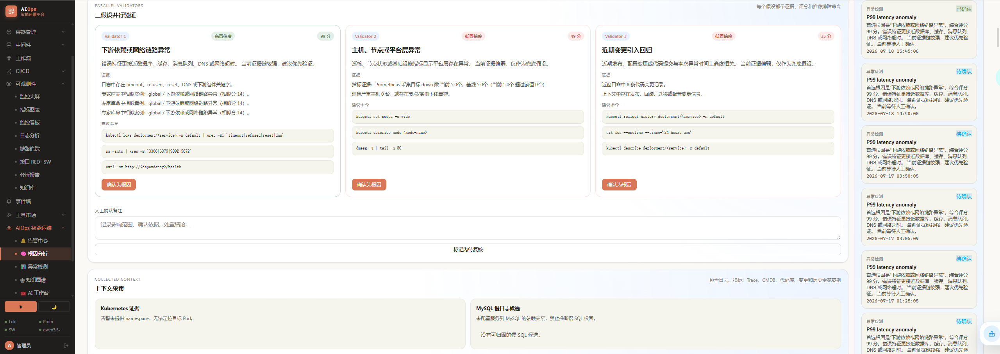
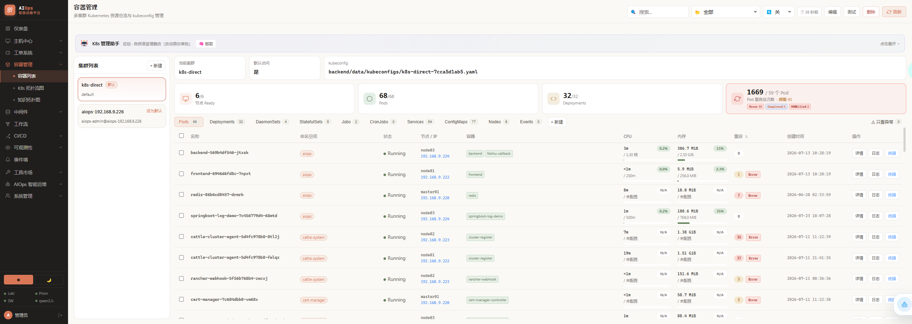

# AIOps 智能运维平台

> 🔥 **AIOps 2.0.0 —— _让排障回到一个流里_。** 日志、指标、链路、告警、CMDB、K8s、工单和知识图谱统一进一个运维工作台，告别在多个页面之间来回切换。平台支持告警感知、根因分析、自动巡检、任务编排和 CLI 交互，目标很直接：把排障这件事变得更快、更稳、更可追踪。
>
> ⚡ **本地优先 + 私有部署。** 这个项目可以直接跑在你的内网、你的服务器、你的 Docker Compose 或 K8s 集群里，适合团队自建与生产环境。
>
> 🧭 **AI 运维闭环。** 从异常出现、证据汇总、根因分析，到工单和复盘，尽量把每一步都保留为可追踪的结果。

<p align="center">
  
</p>

<p align="center">
  <a href="#什么是-aiops-智能运维平台">概览</a> ·
  <a href="#产品速览">产品速览</a> ·
  <a href="#平台兼容性">平台兼容性</a> ·
  <a href="#演示">演示</a> ·
  <a href="#为什么选择这个项目">为什么选择</a> ·
  <a href="#快速开始">快速开始</a> ·
  <a href="#文档入口">文档入口</a>
</p>

<p align="center">
  
  
  
  
  
  
  
</p>

---

## 什么是 AIOps 智能运维平台

🎛️ **面向 DevOps / SRE / 平台工程团队的企业级运维中枢。**
📈 **把日志、指标、链路、告警、主机、容器、工单与知识图谱放到同一个工作台里。**
🤖 **以 LangGraph ReAct 智能体为核心，串起分析、建议、通知和复盘。**
🧩 **支持 Web、CLI、Docker Compose 与 Kubernetes 多种交付方式。**

AIOps 智能运维平台不是单纯的“看板集合”，而是一个把运维里最费时间的部分串成闭环的系统：

- **可观测性工作台**：日志、指标、链路、告警统一查看
- **AI 根因分析器**：自动串联证据链，输出可解释结论
- **资产与平台中枢**：CMDB、SSH、K8s、中间件、任务和工单
- **CLI 运维助手**：在终端里继续同一套分析与执行流程

它的工作方式很简单：

1. 发现异常。
2. 汇总上下文。
3. 交给 AI 分析。
4. 落到执行动作。
5. 把结果沉淀下来，供下一次复用。

---

## 产品速览

快速看懂这个项目长什么样、能做什么。下面这些截图先用示例图占位，后面你可以直接替换成真实界面图。

### 核心页面

<table>
<tr>
<td width="50%" valign="top">
<br/>
<sub><b>故障大盘</b>——首页总览入口。汇总关键告警、服务健康度和待处理事项。</sub>
</td>
<td width="50%" valign="top">
<br/>
<sub><b>告警中心</b>——对原始告警进行聚合、去重、抑制和分组展示。</sub>
</td>
</tr>
<tr>
<td width="50%" valign="top">
<br/>
<sub><b>根因分析</b>——AI 自动串联日志、指标、Trace 和变更线索，输出结构化分析结果。</sub>
</td>
<td width="50%" valign="top">
<br/>
<sub><b>K8s 视图</b>——资源拓扑、部署关系和集群对象的可视化展示。</sub>
</td>
</tr>
</table>

### 运维中台

<table>
<tr>
<td width="50%" valign="top">
<br/>
<sub><b>日志中心</b>——Loki 日志检索、聚类、上下文关联和流式分析。</sub>
</td>
<td width="50%" valign="top">
<br/>
<sub><b>慢日志分析</b>——MySQL 慢日志解析、模板聚类与优化建议。</sub>
</td>
</tr>
<tr>
<td width="50%" valign="top">
<br/>
<sub><b>主机与 CMDB</b>——资产台账、SSH 凭证、同步状态和批量操作。</sub>
</td>
<td width="50%" valign="top">
<br/>
<sub><b>工单与任务</b>——审批流工单、任务中心、定时巡检与自动触发。</sub>
</td>
</tr>
</table>

---

## 平台兼容性

这个项目以 **Web + CLI + Docker Compose + Kubernetes** 的形式交付，适合本地开发、团队自建和生产部署。

| 使用方式 | 状态 | 入口 |
|---|:---:|---|
| Web 平台 | ✅ 支持 | `http://localhost:5173` / `http://localhost` |
| 后端 API | ✅ 支持 | `http://localhost:8000` |
| CLI 终端助手 | ✅ 支持 | `node dist/index.mjs` |
| Docker Compose | ✅ 支持 | `docker compose up -d --build` |
| Kubernetes | ✅ 支持 | `docs/deployment.md` 与 `k8s/` |

<p align="center">
  
</p>

---

## 演示

### 1 · 日志与根因

<table>
<tr>
<td width="50%" valign="top">
<br/>
<sub><b>日志与根因</b>——从日志片段进入分析，自动提取异常模式与时间窗口。</sub>
</td>
<td width="50%" valign="top">
<br/>
<sub><b>联动分析</b>——自动拉取指标、Trace、CMDB 和变更线索，补全证据链。</sub>
</td>
</tr>
</table>

### 2 · 告警与事件

<table>
<tr>
<td width="50%" valign="top">
<br/>
<sub><b>告警与事件</b>——告警聚合、抑制、去重与分组。</sub>
</td>
<td width="50%" valign="top">
<br/>
<sub><b>通知流</b>——飞书 / 钉钉 / Webhook 推送与回调。</sub>
</td>
</tr>
</table>

### 3 · K8s 与中间件

<table>
<tr>
<td width="50%" valign="top">
<br/>
<sub><b>K8s 与中间件</b>——资源拓扑、部署关系和中间件健康度统一查看。</sub>
</td>
<td width="50%" valign="top">
<br/>
<sub><b>直接跳转</b>——从平台内直接进入日志、指标、Grafana 和终端。</sub>
</td>
</tr>
</table>

### 4 · CLI 运维助手

<table>
<tr>
<td width="50%" valign="top">
<br/>
<sub><b>CLI 运维助手</b>——在终端里继续同一套分析、巡检和交互流程。</sub>
</td>
<td width="50%" valign="top">
<br/>
<sub><b>CLI 模式</b>——适合脚本、CI 和日常终端工作流。</sub>
</td>
</tr>
</table>

---

## 为什么选择这个项目

> 这个项目不是单纯“又一个看板”，而是把运维里最费时间的部分串成一个闭环。

| 能力维度 | 传统脚本化运维 | 只有 AI 问答 | AIOps 智能运维平台 |
|---|---|---|---|
| 日志 / 指标 / 链路 | 分散在多个系统里 | 需要手动复制上下文 | 一处聚合，一起分析 |
| 根因定位 | 人工串联证据 | 只有建议，没有流程 | 证据链 + 结论 + 处置建议 |
| 告警处理 | 依赖值班经验 | 容易只给摘要 | 聚合、去重、抑制、通知一体化 |
| CMDB 与资产 | 多半是独立系统 | 很少直接参与分析 | 直接进入分析和同步流程 |
| 工作流 | 靠脚本和约定 | 容易断裂 | 任务、工单、巡检和报告闭环 |
| 部署 | 零散安装 | 很难复现 | Docker Compose / Kubernetes 都支持 |

### 这个项目的特点

- **本地优先**：适合私有环境和内部运维场景
- **AI 可解释**：尽量输出证据链，不只给一句结论
- **功能完整**：不仅能问答，还能巡检、工单、任务编排
- **可扩展**：支持外部工具、MCP 和多种 AI 提供方

---

## 快速开始

### 🐳 使用 Docker Compose 运行

```bash
docker compose up -d --build
```

默认会启动：

- `backend`：`8000`
- `frontend`：`80`
- `redis`

可选组件：

```bash
docker compose --profile neo4j up -d
docker compose --profile grafana up -d
docker compose --profile mysql up -d
docker compose --profile postgres up -d
```

### 🧑‍💻 从源码运行

#### 后端

```bash
cd backend
Copy-Item .env.example .env
python -m venv .venv
.venv\Scripts\Activate.ps1
pip install -r requirements.txt
uvicorn main:app --reload --port 8000
```

#### 前端

```bash
cd frontend
npm install
npm run dev
```

#### CLI

```bash
cd cli
npm install
npm run build
node dist/index.mjs
```

运行后你可以访问：

- 前端：`http://localhost:5173`
- 后端 API：`http://localhost:8000`
- Swagger：`http://localhost:8000/docs`

---

## 一个完整的工作流

`告警 → 聚合 → 检索 → 分析 → 结论 → 工单 → 复盘`

1. **告警进入平台。** 来自 Alertmanager、Webhook 或人工触发。
2. **平台汇总上下文。** 拉取日志、指标、Trace、CMDB、K8s 和历史记录。
3. **AI 进行分析。** 生成根因摘要、影响范围、证据链和建议。
4. **落到执行动作。** 触发巡检、任务、工单或通知推送。
5. **结果沉淀。** 报告、记录和知识图谱持续积累，方便下一次分析。

---

## 从你的编码 Agent 使用

这个项目同时支持在终端里继续工作。CLI 适合脚本、CI、批量排障和纯文本环境。

```bash
cd cli
npm install
npm run build
node dist/index.mjs rca
```

你也可以切换不同模式：

- `chat`：自由对话
- `rca`：根因分析
- `inspect`：系统巡检
- `guided`：引导式排障

---

## 文档入口

如果你要继续看详细说明，优先看这些文件：

- `docs/deployment.md`
- `docs/auth-design.md`
- `docs/aiops-platform-design.md`
- `docs/enterprise-project-organization.md`
- `backend/.env.example`

---

## 许可证

MIT
