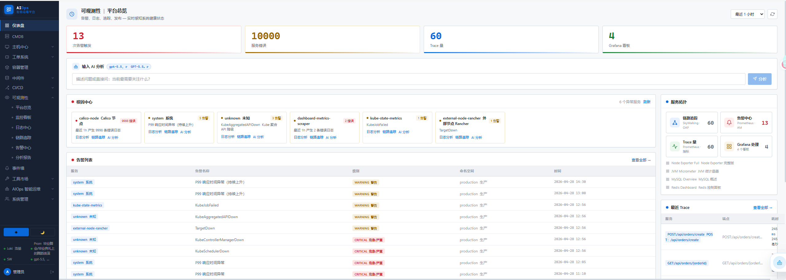

<p align="center">
  
</p>

<h1 align="center">AIOps 智能运维平台</h1>

<p align="center">
  <b>让 AI 替你值夜班 — 告警感知 · 根因分析 · 自动巡检 · 一站式运维</b>
</p>

<p align="center">
  
  
  
  
  
  
  
</p>

---

## 目录

- [项目简介](#项目简介)
- [核心功能](#核心功能)
- [技术架构](#技术架构)
- [目录结构](#目录结构)
- [快速开始](#快速开始)
- [Kubernetes 部署](#kubernetes-部署)
- [环境变量参考](#环境变量参考)
- [页面模块说明](#页面模块说明)
- [AI Agent 工作原理](#ai-agent-工作原理)
- [主要依赖](#主要依赖)
- [常见问题](#常见问题)

---

## 项目简介

**AIOps 智能运维平台** 是一套以 **AI 大模型为核心驱动**的企业级智能运维系统。整合 Loki、Prometheus、SkyWalking、AlertManager 等可观测性数据源，通过 **LangGraph ReAct 智能体** + **四层思考框架** 实现从告警感知到根因定位的全链路自动化。

平台面向 DevOps / SRE 团队，核心目标是：**减少人工排障时间，降低夜班告警压力，让 AI 成为 On-Call 的第一道防线。**

**主要特点：**

- 30 秒内从海量日志和指标中定位故障根因
- 自然语言交互，支持中文 / 英文提问
- 工具执行全链路 Trace 追踪可视化
- 兼容 Anthropic Claude、Qwen3、DeepSeek、GPT 等主流大模型
- Docker Compose 一键启动，Kubernetes 生产级部署就绪

---

## 核心功能

### AI 智能助手

平台内置基于 **LangGraph ReAct** 的运维智能体，具备以下能力：

**四层思考框架**（参考 Hermes Memory v4 设计）：

| 层级 | 职责 | 工作内容 |
|------|------|----------|
| `L1 感知层` | 任务分类 | 识别任务类型（故障排查/性能分析/K8s运维/巡检/报告生成）和关键实体 |
| `L2 检索层` | 多源并发 | 日志 + 指标 + K8s + 告警 + 历史记忆，5路数据同步检索 |
| `L3 推理层` | 跨维度关联 | 时间轴 × 服务实体 × 因果链路，三个维度交叉分析 |
| `L4 沉淀层` | 提炼复用 | 每次输出总结可复用的运维规律，支持下次快速召回 |

**多种对话模式：**

- **RCA 根因分析**：描述异常现象，AI 自动串联日志、指标、SkyWalking Trace，输出结构化根因报告
- **自主巡检**：一键触发全量主机+服务+日志巡检，汇总异常并生成评分报告
- **智能对话**：自由提问，按需调度 22+ 内置工具和 MCP 外部工具
- **AI 开发工作台**：将本地代码目录作为上下文，辅助开发任务和代码阅读

**Trace 追踪面板**：右侧实时显示工具执行步骤、所属思考层级、耗时、输入/输出，执行过程完全透明可审计。

**9 种模型预设**：Qwen3-32B/8B、DeepSeek-R1/V3、Claude Opus/Sonnet、GPT-5 等，支持界面内一键切换和动态编辑 API Key、Base URL、模型 ID。

---

### 可观测性

#### 日志中心（Loki）

- 游标分页突破 4MB 单次返回限制，支持超大日志集合翻页
- **Drain3 自动聚类**：相似日志自动合并模板，快速识别高频错误模式
- AI 流式根因分析：选中异常日志片段，一键触发 AI 分析并 SSE 流式输出
- 关键字链路追踪：从错误 ID/TraceID 跨服务关联日志

#### 指标监控（Prometheus）

- 多维指标查询，主机自动发现
- CPU / 内存 / 磁盘 / 网络负载可视化
- 自定义 PromQL 查询面板

#### 链路追踪（SkyWalking）

- APM 瀑布图：端到端调用链路时序展示
- 服务拓扑图：自动发现服务间调用关系
- P99/P95 性能百分位分析
- 慢接口识别与异常 Span 标注

#### 告警中心（AlertManager）

- 支持高可用 3 副本 AlertManager 集群（K8s NodePort :30093）
- Webhook 实时接收告警推送
- 告警去重聚合，按严重程度分级展示
- 飞书 / 钉钉 / Webhook 实时推送

#### Grafana 内嵌

- API Key 自动看板发现，iFrame 安全嵌入
- 支持多看板切换，Embedding 授权配置

---

### K8s 可视化

基于 SVG + 粒子动画技术构建的 K8s 可视化视图，支持滚轮缩放 + 拖拽平移，深色主题：

| 视图 | 说明 |
|------|------|
| **系统架构图** | 完整服务拓扑，hover 高亮调用链路，粒子流动显示流量方向 |
| **K8s 部署流程** | kubectl → APIServer → etcd → 调度器 → Kubelet → Pod 全链路动画，教学级展示 |
| **K8s 服务图** | Service → Deployment → Pod → Node 四层实时拓扑，动态画布宽度防重叠 |
| **K8s 资源关系图** | 22 个核心资源节点，23 条关系连线，hover 高亮依赖链路 |

---

### CMDB 主机管理

- **资产台账**：JumpServer 标准字段，支持 Excel/CSV 导入导出
- **SSH 凭证管理**：AES 加密存储，支持密码 / 密钥 / 跳板机三种认证方式
- **批量操作**：一键为多台主机应用 SSH 凭证，按分组批量设置
- **数据同步**：SSH 一键同步全量主机系统信息（CPU 核数、内存、OS 版本、磁盘用量）
- **数据新鲜度**：颜色标识同步时效（绿=24h内、黄=24-72h、红=超3天）
- **进程监控**：Top10 进程查看，自动识别 Java/Nginx/Redis/MySQL 服务类型
- **Java 诊断**：Arthas 命令集成 + async-profiler 火焰图，自动探测 JVM 路径
- **主机申请工单**：审批流驱动的主机资源申请

---

### 容器管理

- **K8s 多集群**：Deployment / StatefulSet / DaemonSet / Job / CronJob 全类型管理
- **Pod 日志**：实时日志流，UTC → 东八区（+08:00）自动转换
- **滚动重启**：一键 rollout restart，支持按 Namespace 批量操作
- **Web SSH 终端**：基于 xterm.js + WebSocket，浏览器直连主机/容器，AES 加密凭证库，CMDB 一键跳转

---

### 运维工具

| 模块 | 说明 |
|------|------|
| **AI 运维日报** | 定时（默认每日 9:00）生成健康评分报告，Top 问题汇总，自动推送飞书/钉钉 |
| **巡检报告** | 全量主机 SSH 巡检，阈值判断，AI 逐台生成分析建议，导出 Excel |
| **慢日志分析** | SSH 读取 MySQL 慢日志，Drain3 SQL 模板聚合，AI 输出优化建议 |
| **任务中心** | 定义 + 执行 SSH 批量任务，无需独立 Ansible 环境 |
| **Cron 任务** | 可视化管理主机定时任务，一键停/启 |
| **Jenkins CI/CD** | 多实例管理，Views 分类，任务构建状态实时显示 |
| **工单系统** | 发布工单、SQL 审计工单、事件处理工单、审批流 |
| **事件墙** | AlertManager + 自定义 Webhook 事件聚合展示，Timeline 视图 |
| **中间件监控** | Redis 集群拓扑 + 实时指标、Elasticsearch 集群健康度 |

---

### 通知集成

- **飞书 Bot**：群机器人交互问答，@机器人触发 AI 根因分析，支持 ReAct 进度实时推送
- **钉钉 Webhook**：告警和日报推送
- **MCP 工具**：支持 Prometheus MCP、K8s MCP、Redis MCP 等外部 MCP Server 接入，AI 可按需调用

---

### 权限与安全

- **RBAC 权限**：12+ 模块细粒度权限控制，可按模块独立授权
- **AI 数据范围**：普通用户查询的主机/K8s 资源按分组自动裁剪，AI 不能越权查询
- **用户管理**：注册审批流、分组分配、SSH 凭证 AES-256 加密
- **操作审计**：登录失败锁定（默认 5 次），会话 TTL 管理，操作日志
- **登录保护**：密码复杂度要求，失败次数滑动窗口计数

---

## 技术架构

```
┌─────────────────────────────────────────────────────────────┐
│                    Vue 3.5 前端                              │
│  Pinia · Vue Router · xterm.js · SVG 拓扑动画 · 深色主题     │
└─────────────────────┬───────────────────────────────────────┘
                      │ HTTP / WebSocket / SSE
┌─────────────────────▼───────────────────────────────────────┐
│                  FastAPI 后端 (Python 3.11+)                 │
│                                                             │
│  ┌──────────────────┐  ┌──────────────┐  ┌──────────────┐  │
│  │  LangGraph ReAct │  │  APScheduler │  │  Auth & RBAC │  │
│  │  智能体（4模式）  │  │  定时任务     │  │  权限管理    │  │
│  └────────┬─────────┘  └──────────────┘  └──────────────┘  │
│           │                                                  │
│  ┌────────▼─────────────────────────────────────────────┐   │
│  │                  工具层 / 数据客户端                  │   │
│  │  LokiClient · PromClient · SkyWalkingClient          │   │
│  │  SSHBridge · Drain3 · ReportBuilder · Notifier       │   │
│  │  MilvusMemory · Firecrawl · MCP SDK · kubernetes-py  │   │
│  └──────────────────────────────────────────────────────┘   │
└─────────────────────────────────────────────────────────────┘
      │          │          │          │           │
 ┌────▼───┐ ┌───▼──────┐ ┌─▼────┐ ┌──▼──────┐ ┌──▼──────────┐
 │  Loki  │ │Prometheus│ │  SW  │ │  Redis  │ │AlertManager │
 │  日志  │ │  指标    │ │ APM  │ │  会话   │ │  告警中心   │
 └────────┘ └──────────┘ └──────┘ └─────────┘ └─────────────┘
      │
 ┌────▼──────────────────────────────────────────────────┐
 │  AI Provider（运行时动态切换）                         │
 │  Anthropic Claude · Qwen3-32B · DeepSeek · GPT-5      │
 │  自动识别模型类型，防止参数配错导致 400 错误            │
 └───────────────────────────────────────────────────────┘
```

### 数据流向

```
前端 Vue 组件
  │
  ├─ 普通 REST 请求 ──► FastAPI Router ──► 数据客户端 ──► Loki / Prometheus / SW
  │
  ├─ SSE 流式对话 ──► /api/agent/chat ──► LangGraph Graph
  │                                              │
  │                                    ┌─────────▼──────────┐
  │                                    │  ReAct 推理循环    │
  │                                    │  思考 → 选工具     │
  │                                    │  执行 → 观察结果   │
  │                                    │  → 继续推理或输出  │
  │                                    └────────────────────┘
  │
  └─ WebSocket ──► /api/ssh/ws/{host} ──► asyncssh ──► 目标主机
```

### AI Agent 工具集（22+）

| 层级 | 工具名 | 功能 |
|------|--------|------|
| **L2 检索层** | `query_error_logs` | 查询 Loki 错误日志 |
| | `query_recent_logs` | 查询最近 N 分钟日志 |
| | `count_errors_by_service` | 按服务统计错误数量 |
| | `get_host_metrics` | 获取主机 CPU/内存/磁盘指标 |
| | `get_k8s_summary/pods/nodes/services` | K8s 集群状态查询 |
| | `recall_similar_incidents` | Milvus 向量相似历史案例召回 |
| | `search_daily_reports` | 搜索历史运维日报 |
| **L3 推理/执行层** | `run_ssh_command` | SSH 执行远程命令 |
| | `inspect_all_hosts` | 全量主机并发巡检 |
| | `call_mcp_tool` | 调用外部 MCP 工具 |
| **L4 沉淀层** | `export_report_pdf` | 生成并导出 PDF 报告 |
| | `search_daily_reports_detail` | 历史日报详情检索 |

---

## 目录结构

```
AI-logging-analyse/
├── backend/
│   ├── main.py                    # FastAPI 主入口，注册所有 Router
│   ├── requirements.txt           # Python 依赖
│   ├── Dockerfile                 # 后端镜像构建
│   ├── .env                       # 环境变量配置（不入 Git）
│   │
│   ├── routers/                   # 25+ 业务路由
│   │   ├── agent.py               # AI 智能助手（SSE 流式）+ 对话历史
│   │   ├── agent_config.py        # AI 配置管理（模型/MCP/Skill/行为）
│   │   ├── logs.py                # 日志查询（Loki 游标分页）
│   │   ├── hosts.py               # CMDB 主机管理 + Java 诊断
│   │   ├── kubernetes.py          # K8s 多集群管理
│   │   ├── alerts.py              # AlertManager Webhook 接收
│   │   ├── observability.py       # 可观测性汇总（总览数据）
│   │   ├── reports.py             # AI 日报 + PDF 导出
│   │   ├── ssh.py                 # WebSocket SSH 终端
│   │   ├── skywalking.py          # SkyWalking APM 查询
│   │   ├── slowlog.py             # MySQL 慢日志分析
│   │   ├── elasticsearch.py       # Elasticsearch 集群管理
│   │   ├── redis_clusters.py      # Redis 集群监控
│   │   ├── jenkins.py             # Jenkins CI/CD 多实例
│   │   ├── ansible_tasks.py       # Ansible Playbook 任务
│   │   ├── tickets.py             # 工单系统
│   │   ├── events.py              # 事件聚合
│   │   ├── topology.py            # K8s 拓扑视图
│   │   ├── middleware.py          # 中间件监控
│   │   ├── rca.py                 # 根因分析
│   │   ├── feishu_bot.py          # 飞书 Bot 事件回调
│   │   ├── groups.py              # 用户分组管理
│   │   └── health.py              # 健康检查
│   │
│   ├── agent/                     # AI Agent 核心
│   │   ├── graph.py               # LangGraph ReAct 图定义（四层思考）
│   │   ├── tools.py               # 22+ 运维工具实现
│   │   ├── external_executor.py   # 外部 Agent CLI 调用（Claude Code 等）
│   │   └── milvus_memory.py       # Milvus 向量检索记忆（可选）
│   │
│   ├── auth/                      # 认证鉴权
│   │   ├── router.py              # 登录/注册/注销接口
│   │   ├── admin_router.py        # 管理员用户管理接口
│   │   ├── models.py              # User/Session/Permission ORM 模型
│   │   ├── service.py             # 用户服务逻辑
│   │   ├── deps.py                # 权限检查依赖注入（require_permission）
│   │   └── session.py             # 会话管理
│   │
│   ├── services/                  # 业务服务层
│   │   └── claude_workspace.py    # AI 开发工作台上下文构建
│   │
│   ├── ai_analyzer.py             # AI Provider 抽象层（Anthropic/OpenAI 统一接口）
│   ├── loki_client.py             # Loki HTTP 查询客户端（游标分页）
│   ├── prom_client.py             # Prometheus HTTP 查询客户端
│   ├── skywalking_client.py       # SkyWalking GraphQL 客户端
│   ├── ssh_bridge.py              # asyncssh 桥接层（SSH 连接池）
│   ├── report_builder.py          # 运维日报构建器
│   ├── notifier.py                # 飞书/钉钉通知发送
│   ├── drain3_helper.py           # Drain3 日志/SQL 聚类封装
│   ├── runtime_env.py             # 运行时配置热加载
│   ├── db.py                      # SQLAlchemy 异步引擎（SQLite/MySQL/PG）
│   └── state.py                   # 全局配置常量
│
├── frontend/
│   ├── Dockerfile                 # 前端镜像（Nginx 静态托管）
│   ├── vite.config.js             # Vite 配置（含 /api 代理）
│   ├── package.json
│   └── src/
│       ├── main.js                # Vue 入口
│       ├── App.vue                # 根组件（侧边栏 + 路由出口 + AI 悬浮球）
│       ├── router/
│       │   └── index.js           # 路由定义（45+ 页面路由）
│       ├── stores/
│       │   └── auth.js            # Pinia 用户状态 + 权限判断
│       ├── api/
│       │   └── index.js           # Axios 请求封装（含拦截器）
│       ├── composables/
│       │   └── useHealthStatus.js # AI 模型状态 Composable
│       ├── utils/
│       │   └── uuid.js            # UUID 生成工具
│       ├── components/
│       │   ├── Sidebar.vue        # 侧边栏导航
│       │   └── AIOpsAssistantFloat.vue  # AI 悬浮助手球
│       └── views/                 # 40+ 页面视图
│           ├── Dashboard.vue             # 可观测性总览
│           ├── AIAgent.vue               # AI 智能助手（Trace 面板）
│           ├── AIWorkbenchView.vue       # AI 开发工作台
│           ├── AgentConfig.vue           # AI 配置管理
│           ├── K8sTopologyView.vue       # K8s 拓扑 + 架构图
│           ├── K8sResourceRelationView.vue  # K8s 资源关系图
│           ├── HostCMDB.vue              # CMDB 资产管理
│           ├── ContainerView.vue         # 容器管理
│           ├── SSHTerminal.vue           # Web SSH 终端
│           ├── LogAnalysis.vue           # 日志分析
│           ├── MetricsMonitor.vue        # 指标监控
│           ├── SkyWalkingView.vue        # SkyWalking APM
│           ├── AlertHistory.vue          # 告警历史
│           ├── SlowLogView.vue           # 慢日志分析
│           ├── AnalysisReport.vue        # 运维日报
│           ├── ObsUnifiedView.vue        # 统一观测台
│           ├── FaultDashboardView.vue    # 故障大盘
│           ├── AlertCenterView.vue       # 告警中心
│           ├── RCAView.vue               # 根因分析
│           ├── AnomalyView.vue           # 异常检测
│           ├── EventWallView.vue         # 事件墙
│           ├── JenkinsView.vue           # Jenkins CI/CD
│           ├── MiddlewareView.vue        # 中间件监控
│           └── ...
│
├── k8s/                           # Kubernetes 部署清单
│   ├── namespace.yaml             # Namespace（aiops / monitoring）
│   ├── configmap.yaml             # 非敏感配置（数据源地址等）
│   ├── secret.yaml                # 敏感配置（API Key、密码）
│   ├── backend.yaml               # 后端 Deployment + Service
│   ├── frontend.yaml              # 前端 Deployment + Service
│   ├── redis.yaml                 # Redis Deployment + Service
│   ├── pvc.yaml                   # 持久化存储（数据 + 报告）
│   ├── ingress.yaml               # Ingress 路由规则
│   ├── grafana.yaml               # Grafana 部署
│   ├── skywalking.yaml            # SkyWalking OAP + UI
│   ├── alertmanager.yaml          # AlertManager 配置
│   └── deploy.sh                  # 一键部署脚本
│
├── docker-compose.yml             # Docker Compose（后端 + 前端 + Redis）
├── nginx.conf                     # 前端 Nginx 配置（API 反向代理）
├── build-push.sh                  # 镜像构建 + 推送脚本
└── README.md
```

---

## 快速开始

### 环境要求

**Docker 方式（推荐）：**

- Docker 20.10+
- Docker Compose v2.x

**本地开发方式：**

- Python 3.11+
- Node.js 18+
- npm 或 yarn

### 1. 克隆仓库

```bash
git clone https://github.com/tyloryang/AI-logging-analyse.git
cd AI-logging-analyse
```

### 2. 配置环境变量

```bash
cp backend/.env.example backend/.env
# 编辑 backend/.env，填写数据源地址和 AI API Key
```

**最小配置示例（必填项）：**

```env
# ── 数据源（按需填写，未填的功能不可用）────────────────────────
LOKI_URL=http://your-loki:3100
PROMETHEUS_URL=http://your-prometheus:9090
SKYWALKING_OAP_URL=http://your-skywalking-oap:12800

# ── AI 模型（三选一）──────────────────────────────────────────

# 选项 A：Qwen3 / DeepSeek / 其他 OpenAI 兼容接口（推荐国内用户）
AI_PROVIDER=openai
AI_BASE_URL=https://api.vveai.com/v1
AI_API_KEY=sk-xxxxxxxx
AI_MODEL=qwen3-32b-instruct

# 选项 B：Anthropic Claude
AI_PROVIDER=anthropic
ANTHROPIC_API_KEY=sk-ant-xxxxxxxx
AI_MODEL=claude-sonnet-4-6

# 选项 C：本地 vLLM / Ollama
AI_PROVIDER=openai
AI_BASE_URL=http://192.168.x.x:8000/v1
AI_API_KEY=EMPTY
AI_MODEL=your-local-model-name
```

> **注意 Qwen3 系列**：后端会自动检测模型名中的 `qwen3`、`qwq` 等标识，强制使用 `chat` 模式并关闭 `enable_thinking`，无需手动配置。

### 3. Docker Compose 启动

```bash
docker-compose up -d
```

启动后访问：

| 服务 | 地址 | 说明 |
|------|------|------|
| 前端 | http://localhost | 主界面 |
| 后端 API | http://localhost:8000 | FastAPI |
| API 文档 | http://localhost:8000/docs | Swagger UI |

**初始账号：** `admin`；密码由 `ADMIN_PASSWORD` 指定，留空时首次启动会生成一次性随机密码并写入启动日志。

### 4. 本地开发模式

**启动后端：**

```bash
cd backend
python -m venv .venv
source .venv/bin/activate        # Windows: .venv\Scripts\activate
pip install -r requirements.txt
cp .env.example .env              # 填写配置
uvicorn main:app --reload --port 8000
```

**启动前端（新终端）：**

```bash
cd frontend
npm install
npm run dev   # 访问 http://localhost:5173
```

前端 Vite 已配置 `/api` 代理到 `http://127.0.0.1:8000`，开发时无需手动处理跨域。

### 5. 可选组件启动

**带 Grafana：**
```bash
docker-compose --profile grafana up -d
```

**带 MySQL（替代默认 SQLite）：**
```bash
docker-compose --profile mysql up -d
# 同时在 .env 中设置：
# DATABASE_URL=mysql+aiomysql://aiops:<strong-password>@localhost/aiops
```

**带 PostgreSQL：**
```bash
docker-compose --profile postgres up -d
# DATABASE_URL=postgresql+asyncpg://aiops:<strong-password>@localhost/aiops
```

---

## Kubernetes 部署

### 前提条件

- Kubernetes 1.24+
- kubectl 配置完成
- 本地 Docker Registry（或修改 `k8s/*.yaml` 中的镜像地址）

### 1. 配置

```bash
cd k8s

# 编辑非敏感配置（数据源地址、日志级别等）
vim configmap.yaml

# 编辑敏感配置（API Key、数据库密码）
vim secret.yaml
```

`configmap.yaml` 关键字段：

```yaml
data:
  LOKI_URL: "http://loki.monitoring:3100"
  PROMETHEUS_URL: "http://prometheus.monitoring:9090"
  SKYWALKING_OAP_URL: "http://skywalking-oap:12800"
  AI_PROVIDER: "openai"
  AI_MODEL: "qwen3-32b"
```

`secret.yaml` 关键字段（base64 编码）：

```yaml
stringData:
  AI_API_KEY: "sk-xxxxxxxx"
  ADMIN_PASSWORD: ""
```

### 2. 一键部署

```bash
bash k8s/deploy.sh
```

脚本依次执行：创建 Namespace → 应用 PVC → 应用 ConfigMap/Secret → 部署 Redis → 部署后端 → 部署前端

### 3. 访问地址（默认 NodePort）

| 服务 | NodePort | 说明 |
|------|----------|------|
| 前端 | :30090 | 主界面 |
| 后端 API | :30800 | REST API |
| 飞书 Bot 回调 | :30801 | 飞书事件回调 |
| Grafana | :30300 | Grafana 面板 |
| AlertManager | :30093 | 告警管理 |

### 4. 更新部署

```bash
# 构建并推送新镜像
bash build-push.sh

# 重启 Deployment 拉取最新镜像
kubectl -n aiops rollout restart deployment/backend
kubectl -n aiops rollout restart deployment/frontend
```

---

## 环境变量参考

### 数据源配置

| 变量 | 默认值 | 说明 |
|------|--------|------|
| `LOKI_URL` | — | Loki 查询地址（必填）|
| `LOKI_USERNAME` | — | Loki 用户名（Basic Auth，可选）|
| `LOKI_PASSWORD` | — | Loki 密码（可选）|
| `PROMETHEUS_URL` | — | Prometheus 地址（必填）|
| `SKYWALKING_OAP_URL` | — | SkyWalking OAP GraphQL 端口（默认 12800）|
| `GRAFANA_URL` | — | Grafana 地址（可选，内嵌看板用）|
| `GRAFANA_API_KEY` | — | Grafana API Key（用于看板发现）|

### AI 模型配置

| 变量 | 默认值 | 说明 |
|------|--------|------|
| `AI_PROVIDER` | `anthropic` | `anthropic` 或 `openai`（OpenAI 兼容） |
| `ANTHROPIC_API_KEY` | — | Anthropic API Key（AI_PROVIDER=anthropic 时必填）|
| `AI_BASE_URL` | — | OpenAI 兼容接口地址（AI_PROVIDER=openai 时必填）|
| `AI_API_KEY` | — | OpenAI 兼容接口 API Key |
| `AI_MODEL` | `claude-opus-4-6` | 模型 ID，Qwen3 系列自动适配 |
| `AI_WIRE_API` | 自动检测 | `chat` / `responses`，留空自动识别 |
| `AI_ENABLE_THINKING` | `0` | 扩展思考（QwQ/R1 等推理模型设为 `1`）|

### 应用配置

| 变量 | 默认值 | 说明 |
|------|--------|------|
| `DATABASE_URL` | `sqlite+aiosqlite:///./data/aiops.db` | 数据库连接串，支持 SQLite/MySQL/PostgreSQL |
| `REDIS_URL` | `redis://redis:6379/0` | Redis 连接串（会话存储）|
| `ADMIN_USERNAME` | `admin` | 初始管理员账号 |
| `ADMIN_PASSWORD` | 空（自动生成） | 初始管理员密码；生产环境建议通过 Secret 显式设置强密码 |
| `APP_URL` | `http://localhost:5173` | 前端地址（CORS 白名单）|
| `REPORTS_DIR` | `./reports` | 日报文件存储目录 |

### 定时任务配置

| 变量 | 默认值 | 说明 |
|------|--------|------|
| `SCHEDULE_CRON` | `0 9 * * *` | 日报生成 Cron 表达式（每日 9:00）|
| `SCHEDULE_CHANNELS` | `feishu` | 推送渠道：`feishu` / `dingtalk` / 逗号分隔多个 |
| `FEISHU_WEBHOOK` | — | 飞书机器人 Webhook 地址 |
| `DINGTALK_WEBHOOK` | — | 钉钉机器人 Webhook 地址 |

### 可选功能配置

| 变量 | 默认值 | 说明 |
|------|--------|------|
| `MILVUS_HOST` | — | Milvus 向量数据库地址（历史案例召回功能，可选）|
| `MILVUS_PORT` | `19530` | Milvus 端口 |
| `EMBEDDING_PROVIDER` | `local` | Embedding 服务：`local` / `openai` |
| `LOGIN_FAIL_MAX` | `5` | 登录失败锁定阈值 |
| `LOGIN_FAIL_WINDOW` | `600` | 登录失败计数滑动窗口（秒）|
| `AIOPS_AGENT_EXECUTOR` | `langgraph` | Agent 执行器：`langgraph` / `external_cli` |

---

## 页面模块说明

### 侧边栏导航结构

```
AIOps 智能运维平台
│
├── 仪表盘
│   └── 可观测性总览（首页）
│
├── 可观测性
│   ├── 日志分析（Loki）
│   ├── 慢日志分析（MySQL Slow Log）
│   ├── 指标监控（Prometheus）
│   ├── APM 链路追踪（SkyWalking）
│   ├── 告警历史（AlertManager）
│   └── 分析报告（AI 运维日报）
│
├── 容器
│   ├── 容器管理（K8s）
│   ├── K8s 拓扑图
│   └── K8s 资源关系图
│
├── 中间件
│   ├── 中间件概览
│   ├── Redis 集群
│   └── Elasticsearch
│
├── CI/CD
│   └── Jenkins
│
├── 运维管理
│   ├── CMDB 资产管理
│   ├── 主机任务中心
│   ├── Cron 定时任务
│   ├── SSH 终端
│   ├── Java 诊断（Arthas）
│   ├── 工单 - 发布工单
│   ├── 工单 - SQL 审计
│   ├── 工单 - 事件处理
│   └── 工单 - 审批
│
├── AIOps
│   ├── 故障大盘
│   ├── 告警中心
│   ├── 根因分析
│   ├── 异常检测
│   ├── AI 工作台（开发辅助）
│   ├── 智能助手（运维对话）
│   └── 智能配置（模型/MCP/Skill）
│
└── 系统
    ├── 用户管理（管理员）
    └── 系统设置
```

### 主要页面详解

**可观测性总览（Dashboard.vue）**
- 汇总当前告警数量、错误率、Trace 量、Grafana 看板数
- 最近告警列表、有问题的服务列表（根因中心入口）
- 一键触发 AI 流式分析整体健康状态

**AI 智能助手（AIAgent.vue）**
- 左侧历史对话列表，支持持久化存储到数据库
- 顶部模式切换：RCA 根因分析 / 全面巡检 / 智能对话
- 右侧 Trace 追踪面板：逐步显示工具调用、层级标签、耗时、I/O
- Ansible Playbook 执行结果特殊卡片化展示
- 底部快捷工作台栏（HOME/MODEL/MCP/SKILL 配置状态）

**AI 开发工作台（AIWorkbenchView.vue）**
- 左侧项目列表：自动发现 Claude 本地工作区目录
- 支持手动输入工作目录，无项目时也可直接对话
- 顶部执行器切换：LangGraph 内置 / Claude Code CLI 外部执行器
- CLAUDE.md 项目指令编辑器（每次发消息自动注入上下文）
- Git 状态面板：文件改动列表 + Diff 查看
- Starter Cards 快速填入 Composer（项目扫描/启动分析/接手计划等）

**AI 智能配置（AgentConfig.vue）**
- 模型管理：添加/编辑/激活大模型，支持 OpenAI 兼容和 Anthropic 两种协议
- MCP 工具：配置 MCP Server（SSE/stdio），实时探测在线状态
- Skill 开关：控制 Agent 可调用的工具集
- 行为开关：控制日报推送、自动分析等行为
- SA（Service Account）配置：多实例 Agent 接入管理

---

## AI Agent 工作原理

### LangGraph ReAct 执行流程

```
用户提问
  │
  ▼
[L1 感知] 任务类型识别
  │
  ▼
[L2 检索] 并发调用多个工具
  ├─ query_error_logs（Loki）
  ├─ get_host_metrics（Prometheus）
  ├─ get_k8s_pods（Kubernetes）
  └─ recall_similar_incidents（Milvus）
  │
  ▼
[L3 推理] 跨维度分析
  - 时间轴关联：告警时间 × 日志激增时间 × 指标异常时间
  - 服务链路：上游服务 → 中间层 → 下游服务
  - 因果关系：磁盘满 → 写入失败 → 服务超时 → 级联告警
  │
  ▼
[L4 沉淀] 输出根因报告
  - 结构化 JSON（故障摘要 + 根因 + 影响范围 + 修复建议）
  - 如有向量库，自动保存本次案例供下次召回
  │
  ▼
SSE 流式输出给前端（token by token）
```

### 模型自动适配机制

后端 `ai_analyzer.py` 会在运行时检测模型名称，自动调整调用参数：

- **Qwen3 / QwQ 系列**：强制 `chat` API，关闭 `enable_thinking`，防止 400 错误
- **DeepSeek-R1 / QwQ 推理模型**：启用 `enable_thinking`，支持思考链输出
- **Anthropic Claude**：使用 Anthropic SDK，支持 extended thinking
- **vLLM / Ollama 本地模型**：自动检测 `chat` / `responses` Wire API

### 对话历史持久化

对话记录存储在 SQLite（或 MySQL/PostgreSQL）数据库的 `agent_conversations` 表：

```
agent_conversations
├── id             (bigint, PK)
├── conv_id        (UUID, 前端生成，用于多轮隔离)
├── user_id        (FK → users)
├── mode           (对话模式：chat/rca/inspect/workbench)
├── title          (自动截取首条消息前 60 字符)
├── messages       (JSON，完整消息列表)
├── project_path   (工作台关联的项目目录)
├── created_at
└── updated_at
```

---

## 主要依赖

### 后端

| 依赖 | 版本 | 用途 |
|------|------|------|
| FastAPI | 0.115 | Web 框架 |
| Uvicorn | 0.30 | ASGI 服务器 |
| LangGraph | ≥0.2.35 | ReAct 智能体编排 |
| langchain-core | ≥0.3.0 | LangChain 核心 |
| langchain-anthropic | ≥0.3.0 | Claude 工具调用 |
| langchain-openai | ≥0.2.0 | OpenAI 兼容工具调用 |
| anthropic | ≥0.40.0 | Anthropic SDK |
| openai | ≥1.50.0 | OpenAI SDK |
| SQLAlchemy | ≥2.0.0 | 异步 ORM（SQLite/MySQL/PG）|
| APScheduler | ≥3.10.0 | 定时任务调度 |
| Drain3 | ≥0.9.11 | 日志/SQL 模板聚类 |
| asyncssh | ≥2.14.0 | 异步 SSH 客户端 |
| kubernetes | ≥29.0.0 | K8s Python 客户端 |
| mcp | ≥1.0.0 | Model Context Protocol SDK |
| sse-starlette | 2.1.3 | SSE 流式响应 |
| redis | ≥5.0.0 | Redis 客户端（会话/缓存）|
| httpx | 0.27.2 | 异步 HTTP 客户端 |
| pydantic | 2.8.2 | 数据验证 |

### 前端

| 依赖 | 版本 | 用途 |
|------|------|------|
| Vue | 3.5.13 | 前端框架 |
| Vue Router | 4.4 | 客户端路由 |
| Pinia | 2.2 | 状态管理 |
| xterm.js | 5.3 | Web SSH 终端渲染 |
| xterm-addon-fit | — | xterm 自适应尺寸 |
| Axios | 1.7 | HTTP 请求库 |
| Vite | 5.x | 构建工具 |

---

## 常见问题

### AI 提问返回 400 Bad Request

**原因**：Qwen3 系列模型不支持 `enable_thinking: true` 或 `responses` API。

**解决**：后端已自动检测 Qwen3/QwQ 标识并适配，确保 `AI_MODEL` 名称中包含 `qwen3`、`qwq` 等关键字，或手动设置：

```env
AI_WIRE_API=chat
AI_ENABLE_THINKING=0
```

### 日志查询超时或返回空

**原因**：Loki 单次查询限制（默认 4MB），大时间范围查询容易超出。

**解决**：日志中心已实现游标分页，分批拉取。如仍超时，缩短查询时间范围或增加 `limit` 限制。

### K8s 查询失败

**原因**：后端容器内没有 kubeconfig，或 K8s API Server 不可达。

**解决**：在 K8s 部署时，给 backend Pod 绑定 ServiceAccount 并赋予 cluster-reader 权限，或挂载 kubeconfig Secret。

### 对话历史丢失

**原因**：SQLite 数据库文件未持久化（容器重启后消失）。

**解决**：确保 Docker Compose 的 `./backend/data:/app/data` volume 挂载正确，或切换到 MySQL/PostgreSQL。

### 飞书 Bot 不响应

**原因**：`FEISHU_BOT_APP_SECRET` 或 `FEISHU_BOT_VERIFICATION_TOKEN` 配置错误，或飞书事件回调地址未设置为公网可访问的地址。

**解决**：检查飞书开发者后台的"事件订阅"配置，回调地址格式为：`http://your-public-ip:30801/feishu/callback`

### 前端提示 "AI 服务不可用"

检查步骤：
1. 访问 `http://backend:8000/api/health` 查看 `ai_ready` 字段
2. 检查后端日志确认 API Key 是否有效
3. 确认 `AI_BASE_URL` 格式正确（含 `/v1` 路径，如 `http://host:8000/v1`）

---

## License

[MIT](LICENSE) © 2025 tyloryang
