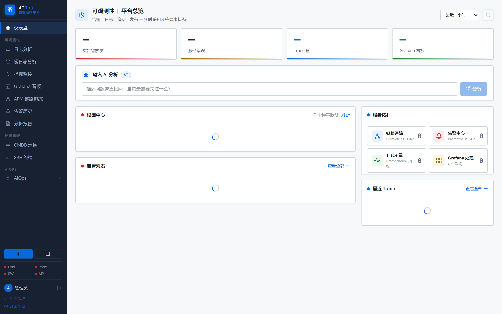
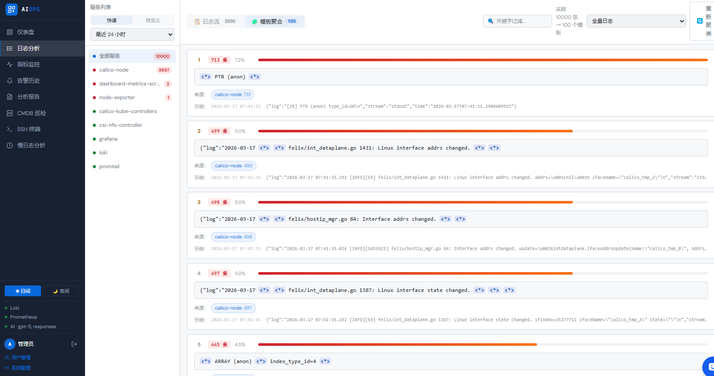

<p align="center">
  <h1 align="center">AIOps · 智能运维平台</h1>
  <p align="center">
    基于 <b>Loki · Prometheus · SkyWalking · LangGraph · AI 大模型</b> 的一站式智能运维平台<br/>
    告别人肉翻日志，让 AI 替你值夜班
  </p>
  <p align="center">
    
    
    
    
    
  </p>
</p>

---

## 项目简介

AIOps 智能运维平台是一套以 AI 为核心驱动的企业级运维平台，整合可观测性数据（日志、指标、链路追踪），通过 LangGraph ReAct 智能体实现自动化根因分析、运维日报生成、主机巡检和慢查询优化，并支持飞书/钉钉实时推送。

- **后端**：Python 3.11 + FastAPI，23 个 Router，160+ 个 API 端点，全异步架构
- **前端**：Vue 3 + Vite + Pinia，36 个视图，系统字体无外链依赖，支持离线部署
- **AI**：支持 Anthropic Claude 和 OpenAI 兼容接口（Qwen3 / vLLM / Ollama）
- **部署**：Docker Compose 一键启动 或 Kubernetes 生产级部署

---

## 界面截图

| 仪表盘总览 | AI 智能助手 |
|:---:|:---:|
|  |  |

| 慢日志分析 | CMDB 巡检 |
|:---:|:---:|
|  |  |

---

## 功能模块

### 可观测性

| 模块 | 说明 |
|------|------|
| **日志中心** | Loki 日志查询、Drain3 自动聚类降噪、AI 流式根因分析 |
| **指标监控** | Prometheus 采集、主机自动发现（node_exporter）、CPU/内存/磁盘/负载 |
| **链路追踪** | SkyWalking APM 链路瀑布图、服务拓扑、性能指标 TopN |
| **告警中心** | 告警规则管理、历史查询、告警分组、噪声压制 |
| **监控看板** | Grafana 内嵌，支持 API Key 自动发现看板 |

### AIOps 智能运维

| 模块 | 说明 |
|------|------|
| **AI 智能助手** | LangGraph ReAct 智能体，支持 RCA / 巡检 / 对话 / 引导式四种模式，工具调用可视化 |
| **根因分析** | 多维数据联合诊断，30 秒内输出故障结论，历史案例 Milvus 向量召回 |
| **异常检测** | 5 分钟周期自动扫描，发现异常指标并触发告警事件 |
| **故障大盘** | 实时故障汇总视图，快速定位高影响服务 |

### 运维管理

| 模块 | 说明 |
|------|------|
| **运维日报** | AI 自动生成健康评分 + Top 问题日报，定时推送飞书/钉钉 |
| **主机巡检** | 全量主机巡检、阈值判断、AI 逐台分析异常、Excel 导出 |
| **CMDB** | 主机资产管理、Prometheus 自动发现、实时指标看板 |
| **慢日志分析** | SSH 读取远端 MySQL 慢日志、Drain3 SQL 聚合、AI 优化建议 |
| **SSH Web Terminal** | 浏览器直连 SSH，AES 凭证库，CMDB 一键连接 |

### 平台能力

| 模块 | 说明 |
|------|------|
| **容器管理** | Kubernetes 工作负载管理、Pod 日志、Pod Exec 终端 |
| **中间件监控** | Redis / MySQL / Nginx 等中间件健康检查与性能监控 |
| **Elasticsearch** | 集群管理、索引查询与分析 |
| **工单系统** | 发布工单、SQL 优化工单、事件工单、审批流 |
| **事件墙** | 运维事件实时流，全局事件上报与查询 |
| **工具市场** | SSH 终端、慢日志分析、指标监控等运维工具入口 |
| **飞书 Bot** | 飞书群机器人交互式问答，AI 实时回复 |
| **用户权限** | 注册审批流、12+ 模块细粒度权限控制、操作审计日志 |

---

## 技术架构

```
┌─────────────────────────────────────────────────────┐
│                   Vue 3 前端 (5173)                  │
│  Pinia · Vue Router · xterm.js · 系统字体(离线兼容)  │
└────────────────────┬────────────────────────────────┘
                     │ HTTP / WebSocket / SSE
┌────────────────────▼────────────────────────────────┐
│              FastAPI 后端 (8000)                     │
│                                                     │
│  ┌──────────────┐  ┌──────────────┐  ┌───────────┐ │
│  │  LangGraph   │  │  APScheduler │  │  Auth     │ │
│  │  ReAct Agent │  │  定时任务     │  │  权限管理  │ │
│  └──────┬───────┘  └──────────────┘  └───────────┘ │
│         │                                           │
│  ┌──────▼────────────────────────────────────────┐  │
│  │              工具层 / 数据客户端               │  │
│  │  LokiClient · PromClient · SkyWalkingClient   │  │
│  │  SSHBridge · SlowLogParser · Drain3 Clusterer │  │
│  │  ReportBuilder · Notifier · MilvusMemory      │  │
│  └───────────────────────────────────────────────┘  │
└────────────────────────────────────────────────────┘
         │           │           │          │
    ┌────▼───┐  ┌────▼─────┐ ┌──▼───┐  ┌──▼──────┐
    │  Loki  │  │Prometheus│ │  SW  │  │  Redis  │
    │  日志  │  │  指标    │ │ APM  │  │  会话   │
    └────────┘  └──────────┘ └──────┘  └─────────┘
         │
    ┌────▼──────────────────────────────────────┐
    │  AI Provider（二选一）                    │
    │  Anthropic Claude  /  OpenAI 兼容接口     │
    │  (Qwen3 / vLLM / Ollama / 私有化部署)    │
    └───────────────────────────────────────────┘
```

### AI Agent 工具集（10+）

LangGraph ReAct 智能体内置工具：

- 查询 Loki 日志（按服务、时间范围、关键字）
- 拉取 Prometheus 指标（CPU / 内存 / 磁盘 / 网络）
- SkyWalking 链路追踪查询
- 主机批量巡检
- 事件检索
- Milvus 历史案例召回
- Elasticsearch 查询
- K8s 资源诊断
- 慢日志分析触发
- 告警历史查询

---

## 快速开始

### 环境要求

- Docker 20.10+ & Docker Compose v2
- 或 Python 3.11+ & Node.js 18+

### 1. 克隆仓库

```bash
git clone https://github.com/tyloryang/AI-logging-analyse.git
cd AI-logging-analyse
```

### 2. 配置环境变量

```bash
cp .env.example .env
```

编辑 `.env`，填写必要配置：

```env
# ── 必填：数据源 ──────────────────────────────────────
LOKI_URL=http://your-loki-host:3100
PROMETHEUS_URL=http://your-prometheus-host:9090

# ── 必填：AI Provider（二选一）───────────────────────
# 选项 A：Anthropic Claude（推荐）
AI_PROVIDER=anthropic
ANTHROPIC_API_KEY=sk-ant-xxxxxxxx
AI_MODEL=claude-opus-4-6

# 选项 B：OpenAI 兼容（Qwen3 / vLLM / Ollama）
AI_PROVIDER=openai
AI_BASE_URL=http://192.168.x.x:8000/v1
AI_API_KEY=
AI_MODEL=Qwen3-32B

# ── 可选：链路追踪 ────────────────────────────────────
SKYWALKING_OAP_URL=http://oap-host:12800

# ── 可选：推送通知 ────────────────────────────────────
FEISHU_WEBHOOK=https://open.feishu.cn/open-apis/bot/v2/hook/xxx
DINGTALK_WEBHOOK=https://oapi.dingtalk.com/robot/send?access_token=xxx

# ── 可选：定时日报（每天 09:00）──────────────────────
SCHEDULE_CRON=0 9 * * *
SCHEDULE_CHANNELS=feishu,dingtalk

# ── 管理员账号 ────────────────────────────────────────
ADMIN_USERNAME=admin
ADMIN_PASSWORD=Admin@123456
```

### 3. Docker Compose 启动

```bash
docker-compose up -d
```

| 服务 | 地址 |
|------|------|
| 前端 | http://localhost |
| 后端 API | http://localhost:8000 |
| API 文档 | http://localhost:8000/docs |

> 如需内置 Grafana：`docker-compose --profile grafana up -d`

### 4. 本地开发启动

```bash
# 后端
cd backend
pip install -r requirements.txt
uvicorn main:app --reload --port 8000

# 前端（新终端）
cd frontend
npm install
npm run dev
```

---

## Kubernetes 部署

```bash
cd k8s

# 1. 编辑配置
vim configmap.yaml   # 填写数据源地址
vim secret.yaml      # 填写 API Key 和密码

# 2. 一键部署
bash deploy.sh
```

访问地址：
- 前端：`http://<node-ip>:30090`
- 后端：`http://<node-ip>:30800`

---

## 目录结构

```
.
├── backend/
│   ├── main.py                  # FastAPI 入口，注册所有 Router
│   ├── routers/                 # 23 个业务 Router
│   │   ├── logs.py              # 日志查询 & AI 分析
│   │   ├── reports.py           # 运维日报 & 巡检推送
│   │   ├── hosts.py             # CMDB 主机管理
│   │   ├── agent.py             # LangGraph ReAct 智能体
│   │   ├── skywalking.py        # APM 链路追踪
│   │   ├── slowlog.py           # MySQL 慢日志分析
│   │   ├── ssh.py               # WebSocket SSH 终端
│   │   ├── kubernetes.py        # K8s 资源管理
│   │   ├── elasticsearch.py     # ES 集群管理
│   │   ├── tickets.py           # 工单系统
│   │   ├── alerts.py            # 告警中心
│   │   ├── feishu_bot.py        # 飞书 Bot
│   │   ├── settings.py          # 系统设置
│   │   └── ...
│   ├── agent/                   # LangGraph Agent 核心
│   │   ├── graph.py             # ReAct 图定义（4 种模式）
│   │   ├── tools.py             # 运维工具集（10+ 工具）
│   │   ├── milvus_memory.py     # 向量检索
│   │   └── report_memory.py     # 日报记忆
│   ├── auth/                    # 认证 & 权限
│   │   ├── models.py            # ORM 模型
│   │   ├── service.py           # 业务逻辑
│   │   └── session.py           # Redis 会话
│   ├── ai_analyzer.py           # AI Provider 抽象
│   ├── loki_client.py           # Loki HTTP 客户端
│   ├── prom_client.py           # Prometheus 客户端
│   ├── scheduler.py             # APScheduler 定时任务
│   ├── report_builder.py        # AI 日报生成
│   ├── notifier.py              # 飞书/钉钉推送
│   ├── ssh_bridge.py            # WebSocket ↔ asyncssh
│   └── db.py                    # SQLAlchemy async
├── frontend/
│   ├── src/
│   │   ├── views/               # 36 个页面视图
│   │   ├── components/          # Sidebar、AI 浮窗等
│   │   ├── stores/              # Pinia 状态（auth）
│   │   ├── api/                 # HTTP + SSE 封装
│   │   ├── composables/         # useTheme 等
│   │   └── router/              # Vue Router（81 条路由）
│   └── index.html
├── k8s/                         # K8s 部署清单
├── docker-compose.yml
├── .env.example
└── README.md
```

---

## 环境变量完整参考

| 变量 | 默认值 | 说明 |
|------|--------|------|
| `LOKI_URL` | — | Loki 地址（必填） |
| `PROMETHEUS_URL` | — | Prometheus 地址（必填） |
| `AI_PROVIDER` | `anthropic` | `anthropic` 或 `openai` |
| `ANTHROPIC_API_KEY` | — | Claude API Key |
| `AI_BASE_URL` | — | OpenAI 兼容接口地址 |
| `AI_API_KEY` | — | OpenAI 兼容 API Key |
| `AI_MODEL` | `claude-opus-4-6` | 模型名称 |
| `AI_ENABLE_THINKING` | `0` | 开启 Thinking 模式（Qwen3 等） |
| `SKYWALKING_OAP_URL` | — | SkyWalking OAP 地址 |
| `GRAFANA_URL` | — | Grafana 地址 |
| `GRAFANA_API_KEY` | — | Grafana API Key |
| `FEISHU_WEBHOOK` | — | 飞书机器人 Webhook |
| `FEISHU_KEYWORD` | — | 飞书消息关键字 |
| `DINGTALK_WEBHOOK` | — | 钉钉机器人 Webhook |
| `SCHEDULE_CRON` | `0 9 * * *` | 日报定时表达式 |
| `SCHEDULE_CHANNELS` | — | 推送渠道（feishu/dingtalk） |
| `DATABASE_URL` | `sqlite+aiosqlite:///./data/aiops.db` | 数据库连接（支持 MySQL / PostgreSQL） |
| `REDIS_URL` | `redis://redis:6379/0` | Redis 会话地址 |
| `MILVUS_HOST` | — | Milvus 向量库地址（可选） |
| `SSH_FERNET_KEY` | — | SSH 凭证 AES 加密密钥 |
| `ADMIN_USERNAME` | `admin` | 初始管理员账号 |
| `ADMIN_PASSWORD` | `Admin@123456` | 初始管理员密码 |
| `SESSION_TTL_SECONDS` | `28800` | 登录会话有效期（秒） |
| `LOGIN_FAIL_MAX` | `5` | 登录失败锁定次数 |

---

## 主要依赖

**后端**

| 依赖 | 版本 | 用途 |
|------|------|------|
| FastAPI | 0.115 | Web 框架 |
| LangGraph | ≥0.2.35 | ReAct 智能体 |
| Anthropic | ≥0.40 | Claude API |
| OpenAI | ≥1.50 | OpenAI 兼容接口 |
| SQLAlchemy | ≥2.0 | 异步 ORM |
| APScheduler | ≥3.10 | 定时任务 |
| Drain3 | ≥0.9.11 | 日志/SQL 聚类 |
| asyncssh | ≥2.14 | SSH 远程执行 |
| kubernetes | ≥29.0 | K8s Python 客户端 |
| redis | ≥5.0 | 会话管理 |

**前端**

| 依赖 | 版本 | 用途 |
|------|------|------|
| Vue | 3.5 | 前端框架 |
| Vue Router | 4.4 | 路由管理 |
| Pinia | 2.2 | 状态管理 |
| xterm.js | 5.3 | Web Terminal |
| Axios | 1.7 | HTTP 客户端 |

---

## License

MIT
