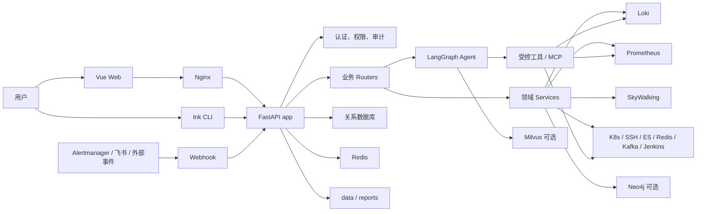

# 01. 系统架构总览

## 1. 项目定位

`loki-log-analyse` 已经不只是 Loki 查询页面。当前源码呈现的是一个综合 AIOps 平台，主要能力包括：

- Loki 日志查询、上下文、错误聚合、模板聚类和 AI 分析；
- Prometheus 指标查询、可视化和 HTTP 服务指标分析；
- SkyWalking 链路、拓扑与端点诊断；
- Kubernetes、主机 SSH、Jenkins、Elasticsearch、Redis、Kafka 等运维连接器；
- 告警接入、事件归一化、异常检测、RCA、知识图谱和证据链；
- LangGraph Agent、MCP、工具市场和多执行器；
- 巡检、日报、慢日志报告、通知、工单、工作流和定时任务；
- Vue Web 控制台、Ink 终端 CLI、飞书回调服务三种交互入口。

## 2. 技术栈

| 层 | 当前实现 | 证据入口 |
| --- | --- | --- |
| Web | Vue 3、Vue Router、Pinia、Axios、Vite | [`frontend/package.json`](../../frontend/package.json) |
| CLI | React 18、Ink、Ink Text Input | [`cli/package.json`](../../cli/package.json) |
| API | FastAPI、Pydantic、SSE Starlette、Uvicorn | [`backend/requirements.txt`](../../backend/requirements.txt) |
| Agent | LangGraph、LangChain、OpenAI/Anthropic 适配 | [`backend/agent/graph.py`](../../backend/agent/graph.py) |
| 数据 | SQLAlchemy Async、SQLite/MySQL/PostgreSQL、Redis | [`backend/db.py`](../../backend/db.py) |
| 可观测 | Loki、Prometheus、SkyWalking、Grafana | [`backend/state.py`](../../backend/state.py) |
| 基础设施 | Kubernetes、AsyncSSH、Kafka、Neo4j | [`backend/requirements.txt`](../../backend/requirements.txt) |
| 部署 | Docker Compose、Nginx、可选 Neo4j/Grafana/MySQL/PostgreSQL | [`docker-compose.yml`](../../docker-compose.yml) |

## 3. 总体架构



## 4. 四类入口

### 4.1 Web 请求

[`frontend/src/main.js`](../../frontend/src/main.js) 创建 Vue 应用，安装 Pinia 与 Router。页面通过 [`frontend/src/api/index.js`](../../frontend/src/api/index.js) 访问 `/api/*`，生产部署由 Nginx 代理到后端。

[`frontend/src/App.vue`](../../frontend/src/App.vue) 区分三种布局：

- `meta.public`：登录、注册等公开页面；
- `meta.fullscreen`：仍受登录保护，但不显示侧边栏；
- 普通业务页：`Sidebar + router-view + AI 助手浮窗 + 命令面板`。

### 4.2 FastAPI 请求

后端组合根是 [`backend/main.py`](../../backend/main.py)。它创建 `FastAPI` 应用并集中注册三十余个 Router。一个典型请求遵循：

```text
HTTP -> 认证中间件/依赖 -> Router -> Client 或 Service -> 外部系统/存储 -> JSON/SSE
```

### 4.3 CLI 请求

[`cli/index.mjs`](../../cli/index.mjs) 是一个 Ink 应用。它维护登录用户、模式、会话历史、流式消息和工具事件；提交文本后调用 Agent SSE 接口，并把 Web 与 CLI 的会话保存到同一后端。

### 4.4 后台与回调入口

- [`backend/main.py`](../../backend/main.py) 的 `lifespan()` 启动日报、异常检测、分组巡检、cron tick；
- [`backend/feishu_callback_app.py`](../../backend/feishu_callback_app.py) 可作为独立飞书回调服务运行；
- 告警、事件和飞书路由接收外部推送；
- 工作流和 Ansible 定时任务由统一 tick 驱动。

## 5. 启动阶段发生什么

`lifespan()` 的关键顺序是：

1. 注册并启动 APScheduler 作业；
2. 创建 `data` 目录；
3. 用 SQLAlchemy 创建表并执行增量列迁移；
4. 同步权限模块并确保初始管理员存在；
5. 后台同步历史报告元数据；
6. 后台尝试把历史日报导入 Milvus 记忆；
7. 应用退出时停止 scheduler。

这里有两个重要设计点：

- 报告同步和 Milvus 导入通过后台任务执行，不阻塞 API 启动；
- 可选组件失败通常只记录告警，不应让核心 API 无法启动。

## 6. 部署拓扑

默认 Compose 启动：

```text
浏览器 :80 -> frontend/Nginx -> backend:8000
                              -> Redis 7
```

以下服务用 profile 按需启用：

- `neo4j`：知识图谱持久化；
- `grafana`：嵌入式监控看板；
- `mysql` 或 `postgres`：替代默认关系数据库。

后端挂载 `backend/reports` 与 `backend/data`，说明这两个目录是部署级持久状态，而不是临时缓存。

## 7. 架构阅读中的常见误判

- 误判一：把所有业务逻辑都归到 `backend/main.py`。它主要是组合根，真正逻辑散在 Router、Service、Client 和 Agent 工具中。
- 误判二：认为 Agent 是另一个独立服务。当前主 Agent 与 FastAPI 在同一后端进程中构建和执行。
- 误判三：把 Redis 当主业务数据库。关系实体由 SQLAlchemy 管理，Redis 更偏缓存、状态、队列或 checkpoint。
- 误判四：只看 Web 页面。CLI、Webhook 和 scheduler 都能触发业务链路。
- 误判五：认为“接口返回 200”等于业务完成。报告和 SSE 流存在后台生成与分阶段可见状态。

## 8. 自检

1. 为什么排查一个定时巡检问题时，不能只看 HTTP Router？
2. 为什么 `data/`、`reports/` 和关系数据库都需要纳入备份策略？
3. Agent 工具访问 Loki 与普通日志页面访问 Loki，哪些层可以复用，哪些层必须保留不同的权限控制？

