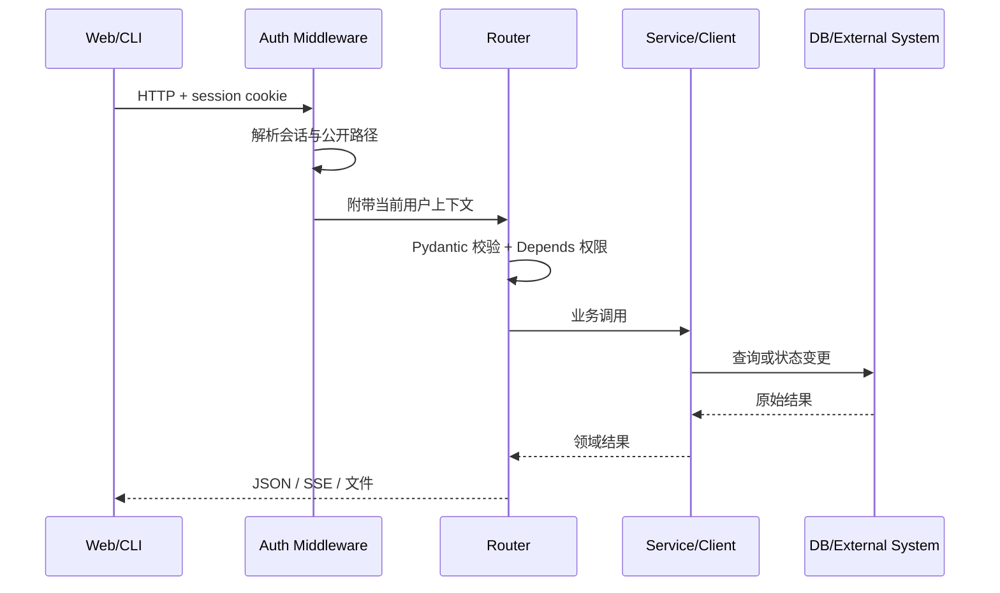

# 03. 后端运行时、认证与存储

## 1. FastAPI 组合根

[`backend/main.py`](../../backend/main.py) 的职责可以概括成三类：

1. 在模块加载期完成环境引导、依赖导入和应用对象创建；
2. 在 `lifespan()` 中管理启动/关闭资源；
3. 用 `include_router()` 把领域接口挂到同一个应用。

它集中注册日志、报告、主机、SSH、健康检查、设置、Agent、SkyWalking、K8s、事件、中间件、工单、ES、Redis、Kafka、告警、RCA、知识图谱、Jenkins、工作流等 Router。

这使 `main.py` 成为 composition root，而不是业务规则的归宿。

## 2. 一次普通 API 请求

要区分两层控制：

- 中间件解决“是否需要登录、会话是否有效”；
- `Depends(require_admin)` 或模块权限解决“已登录用户是否允许执行该动作”。

## 3. 认证模块

[`backend/auth`](../../backend/auth) 的分工：

| 文件 | 职责 |
| --- | --- |
| `router.py` | 注册、登录、退出、当前用户、修改密码 |
| `admin_router.py` | 用户审批、禁用、权限、审计、CMDB/K8s 资源授权 |
| `middleware.py` | HTTP 请求会话保护与公开路径处理 |
| `deps.py` | `current_user`、管理员/权限依赖 |
| `service.py` | 用户、密码、模块同步、初始管理员业务规则 |
| `session.py` | 会话创建、读取、撤销与安全属性 |
| `models.py` | 用户、权限、会话等 ORM 实体 |
| `audit.py` | 安全与管理操作审计 |

### 权限不是只有 admin/non-admin

前端通过 `authStore.can(module, action)` 控制入口，后端仍必须通过依赖和资源范围再次校验。管理端还支持用户到 CMDB 组、K8s 集群的授权映射，因此权限至少包含：

- 身份状态：未登录、待审批、启用、禁用；
- 平台角色：普通用户、管理员；
- 模块动作：view/create/update/delete 等；
- 资源范围：允许访问的主机组、K8s 集群。

前端隐藏按钮不是安全边界，后端校验才是。

## 4. 数据库初始化

[`backend/db.py`](../../backend/db.py) 提供异步 SQLAlchemy engine、session factory 与 Base。启动时：

1. `Base.metadata.create_all` 创建缺失表；
2. `_migrate_add_columns` 对已有实例做轻量增量迁移；
3. `sync_modules` 同步 RBAC 模块清单；
4. `ensure_admin` 在需要时创建初始管理员。

部署同时支持 SQLite、MySQL 与 PostgreSQL。阅读数据库问题时必须先确认 `DATABASE_URL`，不能假设所有环境都用 SQLite。

## 5. 多种持久状态

该项目采用“按数据性质选存储”，不是单一数据库：

| 存储 | 典型内容 | 入口 |
| --- | --- | --- |
| 关系数据库 | 用户、权限、会话、审计等结构化实体 | `db.py`、`auth/models.py` |
| JSON/文件 | 连接器配置、快照、Agent 配置、报告正文 | `json_snapshot_store.py`、`data/`、`reports/` |
| Redis | 缓存、运行状态、可能的 checkpoint/协作状态 | `docker-compose.yml`、Agent/服务配置 |
| Neo4j | 可选知识图谱节点与关系 | `services/knowledge_graph.py` |
| Milvus | 可选报告/Agent 语义记忆 | `agent/report_memory.py`、`agent/milvus_memory.py` |
| 外部系统 | 日志、指标、链路、集群事实 | Loki/Prometheus/SkyWalking/K8s 等客户端 |

### 一致性风险

当一个流程同时写文件和数据库时，可能出现：

- 文件成功、元数据失败；
- 元数据存在、报告文件缺失；
- 核心数据成功、Milvus/Neo4j 可选索引失败；
- 页面轮询到了列表，但 AI 流仍未结束。

因此，代码中常见“后台同步”“跳过已导入”“失败不阻塞启动”等容错策略。

## 6. Scheduler 与后台任务

`lifespan()` 注册：

| Job | 周期 | 目的 |
| --- | --- | --- |
| `daily_report` | `SCHEDULE_CRON` | 生成并按配置推送日报 |
| `anomaly_detection` | 每 5 分钟 | 运行异常检测 |
| `group_schedule` | 每分钟 | 检查分组巡检计划 |
| `cron_ticker` | 每分钟 | 驱动 Ansible 与工作流 cron |

Scheduler 任务与 HTTP 请求共享进程和配置，但没有浏览器请求上下文。排查权限、路径和环境变量时不要套用 Web 请求的假设。

## 7. 配置刷新

[`backend/runtime_env.py`](../../backend/runtime_env.py) 负责把 `.env` 与运行时设置同步到进程环境。Agent 构建模型时会刷新设置，因此管理页面修改 AI Provider 后不一定需要重启整个服务。

配置读取需注意优先级：请求级 model override、运行时配置、环境变量可能同时存在。排查“为什么用了另一个模型”时，应沿 `_build_runtime_overrides -> build_graph -> _get_llm` 检查最终值。

## 8. 常见问题定位

### 登录后仍返回 401

依次检查：Cookie 是否发送、会话是否存在/过期、用户是否启用、代理是否保留 Cookie、安全属性是否与 HTTP/HTTPS 匹配。

### 页面可见但接口返回 403

检查后端模块动作权限和资源范围；不要只改前端 `can()`。

### 启动变慢

区分同步初始化与后台导入。数据库建表/迁移在 `yield` 前；历史报告和 Milvus 导入被创建为后台任务。

### 重启后数据丢失

确认 Compose 是否挂载 `backend/data`、`backend/reports`，数据库是否使用持久卷，当前配置是否指向容器内临时路径。

## 9. 自检

1. 用户能看到 K8s 页面但看不到某个集群，最可能还缺哪一层授权？
2. 为什么可选 Milvus 导入失败不应该阻塞登录接口？
3. 一个报告列表项存在但正文打不开，应先检查哪两种存储？

