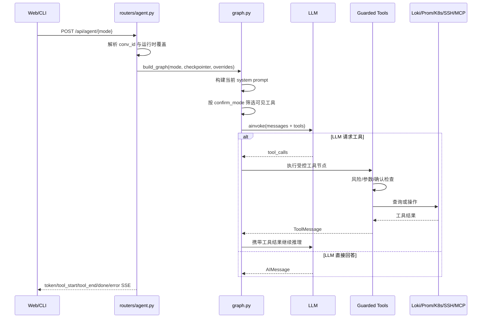

# 04. AI Agent、工具调用与 RCA

## 1. Agent 不是单次 LLM 调用

当前主路径由 [`backend/routers/agent.py`](../../backend/routers/agent.py) 接收请求，使用 [`backend/agent/graph.py`](../../backend/agent/graph.py) 构建 LangGraph ReAct 图。它支持四种交互模式：

- `chat`：普通问答，强调按需选择工具；
- `rca`：根因分析，启用更强的分层诊断提示；
- `inspect`：巡检与综合检查；
- `guided`：引导式执行，提示词策略不同。

请求模型 `AgentRequest` 还允许覆盖模型、Provider、Base URL、Wire API 和 executor。

## 2. 请求到 SSE 的主链路



## 3. Graph 构建细节

`build_graph()` 每个请求轻量构建一张图：

```text
START -> agent_node -> should_continue
                         | tool_calls
                         v
                       tools -> agent_node
                         |
                         + no tool call -> END
```

关键步骤：

1. `_load_enabled_mcps()` 读取启用的 MCP；
2. `_build_system_prompt(mode)` 注入模式提示与 MCP 名称；
3. 根据 `confirm_mode` 调用 `tools_for_runtime()` 裁剪模型可见工具；
4. `_get_llm()` 选择 OpenAI-compatible、Responses API 或 Anthropic；
5. `bind_tools()` 把工具 schema 交给模型；
6. `_build_guarded_tools_node()` 执行真正的工具安全控制；
7. graph 使用 checkpointer 支持多轮状态。

### 为什么每轮替换 system prompt

`_with_current_system_prompt()` 会替换 checkpoint 中旧的 SystemMessage。否则管理员刚改过模式策略或工具规则，旧会话仍可能继续使用陈旧提示词。

## 4. 模型适配

`_get_llm()` 的决策包括：

- `AI_PROVIDER=openai` 使用 OpenAI-compatible endpoint；
- GPT-5/O 系列默认选择 Responses API；
- Qwen3/QwQ 强制 Chat API，并关闭非流式 thinking；
- 其他 OpenAI-compatible 模型默认 Chat Completions；
- `anthropic` 使用 `ChatAnthropic`；
- 请求级覆盖优先于进程环境。

这解释了为什么“Provider 一样”不代表线协议一样。排查模型兼容问题必须同时记录 Provider、model、base URL、wire API 与 thinking 配置。

## 5. 工具组织与安全

工具分成三层：

```text
tool_modules/*.py    领域工具实现
       ↓
agent/tools.py       汇总 ALL_TOOLS 与分组
       ↓
graph.py             运行时可见性 + guarded execution
```

安全不能只依赖提示词：

- 低风险读操作可直接暴露；
- 高风险写操作在 `ask` 模式下可从模型可见列表移除；
- 真正执行前还要由 guarded node 做参数、风险和确认检查；
- Router 自身的登录/RBAC 仍然存在；
- Webhook 与 Agent 工具需分别防止未授权触发。

## 6. 多执行器

`AgentRequest.executor` 和系统配置允许选择：

- `langgraph`：本节描述的内置 ReAct Agent；
- `external_cli`：外部 CLI 执行器适配；
- `aiops_cli`：项目自己的命令行执行路径。

因此排查“Agent 输出格式不同”时，第一步是确认 executor，而不是直接修改 prompt。

## 7. RCA 领域链路

RCA 既可由 Agent 工具触发，也有独立 API：

- [`backend/routers/rca.py`](../../backend/routers/rca.py)：定位、两阶段流式分析、结果、反馈、异常；
- [`backend/services/rca_localizer.py`](../../backend/services/rca_localizer.py)：从拓扑/信号中定位候选对象；
- [`backend/services/rca_engine.py`](../../backend/services/rca_engine.py)：组织证据、推断和结论；
- [`backend/services/evidence.py`](../../backend/services/evidence.py)：统一证据对象；
- [`backend/services/knowledge_graph.py`](../../backend/services/knowledge_graph.py)：CMDB/K8s/SkyWalking 关系图。

推荐的心智模型：

```text
事件/告警
  -> 归一化与去重
  -> 候选故障对象定位
  -> 拉取日志、指标、链路、拓扑证据
  -> 证据打分与时间相关性
  -> LLM/规则解释
  -> 根因、影响面、建议、置信度
  -> 人工确认与反馈
```

## 8. 知识图谱

[`backend/services/knowledge_graph.py`](../../backend/services/knowledge_graph.py) 可从 CMDB、K8s、SkyWalking 构建图，Router 提供：

- `/api/kg/build`：重建图；
- `/api/kg/status`、`/stats`：查看状态；
- `/api/kg/graph`、`/neighbors`：读取图与邻居；
- `/nodes`、`/relations`：手工维护节点和关系。

Neo4j 是可选持久化；没有启用时，核心平台不应被等同为“不可运行”。

## 9. SSE 事件语义

Web 与 CLI 都需要正确处理至少这些事件：

| 事件 | UI 行为 |
| --- | --- |
| `token` | 追加模型文本 |
| `tool_start` | 展示工具名称与输入 |
| `tool_end` | 展示工具输出并结束该工具状态 |
| `replace_content` | 用紧凑完成结果替换已有内容 |
| `error` | 结束 busy 并显示错误 |
| `done` | 完成一次响应并允许保存会话 |

只处理 token 会导致“工具执行中一直转圈”或“最终内容重复”。

## 10. 常见误判

- Agent 重复同一诊断链不一定是模型问题，可能是模式 prompt 或旧 checkpoint。
- 工具没被调用不一定是工具坏了，可能是 `confirm_mode` 让它不可见。
- 输出与 Web 不同不一定是前端渲染，可能选择了不同 executor。
- RCA 有结论不代表证据充分，应检查 evidence 来源、时间窗和置信度。
- 模型返回 400 不一定是 API Key，可能是 wire API 与模型类型不匹配。

## 11. 自检

1. 为什么既要“模型可见工具裁剪”，又要“执行节点二次保护”？
2. 修改 chat prompt 后，为什么旧会话可能需要替换 SystemMessage？
3. 如何区分“LLM 没选择工具”“工具被隐藏”“工具执行失败”三类问题？

