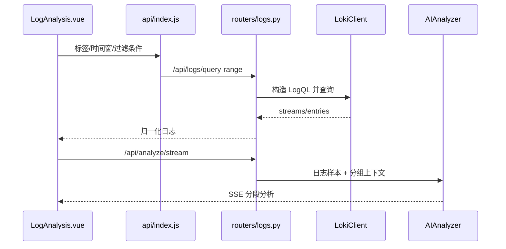

# 05. Loki 日志、慢日志与报告链路

## 1. 三条相关但不同的链路

本项目里的“日志分析”至少包含三条路径：

1. Loki 在线日志查询与 AI 分析；
2. 通过 SSH 拉取 MySQL slow log 并解析；
3. 聚合日志、指标、告警和巡检结果生成报告。

它们共享 UI、AI 与通知能力，但数据源、解析器和持久化方式不同。

## 2. Loki 在线查询

### 主要入口

- 前端：[`frontend/src/views/LogAnalysis.vue`](../../frontend/src/views/LogAnalysis.vue)
- API：[`frontend/src/api/index.js`](../../frontend/src/api/index.js)
- Router：[`backend/routers/logs.py`](../../backend/routers/logs.py)
- Client：[`backend/loki_client.py`](../../backend/loki_client.py)
- 分析：[`backend/ai_analyzer.py`](../../backend/ai_analyzer.py)
- 模板聚类：[`backend/log_clusterer.py`](../../backend/log_clusterer.py)

### 接口能力

`routers/logs.py` 暴露的主能力包括：

- 服务、标签和值发现；
- `query-range`、普通日志列表、上下文；
- 错误日志与错误数量；
- 日志模板；
- trace 关联；
- 模板分析和普通分析的 SSE 流。

### 查询链路



### 前端过滤模型

`LogAnalysis.vue` 维护：

- 时间窗口与服务选择；
- Loki label catalog；
- 多标签过滤器，同一标签可多值合并为 regex；
- 标签名/标签值搜索下拉；
- 分组字段、钻取条件和 AI 分析状态。

排查“没有日志”时，应把 UI 条件还原成最终 LogQL，而不是只看页面下拉值。

## 3. 慢日志链路

### 主要入口

- 页面：[`frontend/src/views/SlowLogView.vue`](../../frontend/src/views/SlowLogView.vue)
- Router：[`backend/routers/slowlog.py`](../../backend/routers/slowlog.py)
- Parser：[`backend/slow_log_parser.py`](../../backend/slow_log_parser.py)
- SSH：[`backend/ssh_utils.py`](../../backend/ssh_utils.py)

### 工作流

```text
选择 CMDB 主机/凭证或手工 SSH 参数
  -> 指定 slow log 路径、阈值、起止时间、tail 大小
  -> POST /api/slowlog/fetch
  -> SSH 读取远端文件片段
  -> slow_log_parser 解析 Query_time、Rows_examined、SQL 等字段
  -> 阈值过滤与聚合
  -> /api/slowlog/analyze/stream 生成 AI 分析
  -> /api/slowlog/export 导出结果
```

页面把非敏感选择与时间参数放入 `sessionStorage` 以改善重复操作体验；这不等同于后端凭证库，也不应成为长期秘密存储。

### 时间范围细节

页面支持：

- 标准 `YYYY-MM-DD HH:mm:ss`；
- 粘贴一个完整时间，自动生成前 5 分钟窗口；
- 粘贴两个日期/时间，自动取最小开始与最大结束；
- 校验结束时间不能早于开始时间。

如果结果不符合预期，需同时核对浏览器本地时区、后端解析和慢日志事件时间格式。

## 4. 报告生成链路

### 主要入口

- 页面：[`frontend/src/views/AnalysisReport.vue`](../../frontend/src/views/AnalysisReport.vue)
- Router：[`backend/routers/reports.py`](../../backend/routers/reports.py)
- 构建器：[`backend/report_builder.py`](../../backend/report_builder.py)
- 元数据：[`backend/report_store.py`](../../backend/report_store.py)
- 通知：[`backend/notifier.py`](../../backend/notifier.py)
- PDF：[`backend/services/report_pdf.py`](../../backend/services/report_pdf.py)

报告 Router 支持：日报生成/列表/详情、巡检报告、分组生成、Excel/HTML/PDF 导出、飞书/钉钉/分组通知，以及慢日志报告目标配置与生成。

### 分阶段可见性

报告生成不是“AI 完成后才有一切”。更可靠的模型是：

```text
采集基础数据
  -> 创建报告 ID 与基础元数据
  -> 基础报告先可见
  -> AI 内容通过流式或后台过程补充
  -> 文件/元数据更新
  -> 可选通知与语义记忆导入
```

这能避免用户把“AI 较慢”误认为“整个报告没有生成”。前端应分别展示列表加载、报告生成、AI 流、通知状态。

## 5. 报告的状态边界

| 状态 | 可能位置 |
| --- | --- |
| 报告正文 | `reports/` 文件 |
| 报告元数据 | 关系数据库或 report store |
| 页面当前对象 | Vue reactive state |
| AI 流内容 | SSE 客户端缓冲 |
| 历史语义记忆 | 可选 Milvus |
| 通知结果 | 外部飞书/钉钉响应与日志 |

这也是报告问题最容易“看起来卡住”的原因：任何两层状态都可能暂时不同步。

## 6. SSE 客户端必须处理什么

[`frontend/src/api/index.js`](../../frontend/src/api/index.js) 的流式助手需要处理：

- HTTP 非 2xx；
- chunk 边界不等于事件边界；
- 一次读取可能含多个 `data:`；
- 最后一个事件可能没有大文本；
- Abort/页面销毁；
- error 与 done 都要复位 loading；
- 基础结果和 AI 文本应使用不同状态变量。

## 7. 排障剧本

### 日志列表为空

1. 检查时间窗和时区；
2. 检查 label 名是否与 Loki 实际标签一致；
3. 检查同标签多值是否正确形成 regex；
4. 直接记录最终 LogQL 和 Loki 原始响应；
5. 区分“Loki 无结果”和“前端过滤后为空”。

### 慢日志为空

1. SSH 是否能读取目标路径；
2. `tail_mb` 是否覆盖所选时间；
3. parser 是否识别文件格式；
4. `threshold_sec` 是否过高；
5. 时间范围与日志时区是否一致。

### 报告一直生成中

1. 列表是否已经出现元数据；
2. 报告文件是否已创建；
3. SSE 是否收到基础事件、token、done 或 error；
4. AI Provider 是否超时；
5. 前端 finally 是否复位 generating；
6. 页面是否错误地把“AI 未结束”等同于“报告不存在”。

## 8. 常见误判

- 把 Loki 标签名写死为 `app`；实际环境可能使用 `service`、`job`、`namespace` 等。
- 把 SSH 文件尾部读取当成完整时间范围查询；较大的时间窗可能已超出 tail。
- 把解析失败当作没有慢 SQL；先看原始片段和 parser 结果。
- 把报告正文文件与列表元数据视为同一事务；它们可能分阶段持久化。
- 只看 SSE token，不处理 error/done，导致页面 busy 状态不释放。

## 9. 自检

1. 为什么同一标签选择多个值时通常要构造 regex，而不是多个相互覆盖的 matcher？
2. 慢日志所选时间正确但结果为空，`tail_mb` 为什么仍可能是根因？
3. 如何用三个证据区分“报告未创建”和“仅 AI 补充内容还没结束”？

