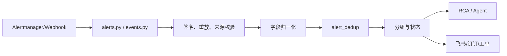

# 06. 可观测性与基础设施连接器

## 1. 可观测数据的四个层次

```text
日志 Logs       -> Loki
指标 Metrics    -> Prometheus / Grafana
链路 Traces     -> SkyWalking
拓扑 Topology   -> SkyWalking + K8s + CMDB + 知识图谱
```

平台的价值不只是把四类数据分别展示，而是让告警、RCA 和 Agent 能在同一个时间窗内交叉引用。

## 2. 共享客户端状态

[`backend/state.py`](../../backend/state.py) 初始化并暴露 Loki、Prometheus、SkyWalking 等共享客户端和报告目录。Router 通常从 `state` 取得客户端，而不是每个请求重新创建连接。

优点：

- 复用连接池与配置；
- 统一健康状态；
- 避免 Router 到处重复环境变量解析。

风险：运行时配置更新后，需确认共享客户端是否被刷新或重建；只更新 `.env` 文件不一定自动改变已创建对象。

## 3. Prometheus 与统一可观测 Router

[`backend/routers/observability.py`](../../backend/routers/observability.py) 提供：

- 统一 overview、alerts、traces、services；
- 综合分析；
- PromQL 即时/区间查询；
- label values；
- HTTP server 指标标签清单和值；
- HTTP server count/rate/latency 图表数据；
- Grafana 看板配置与发现；
- 自定义 metric panels。

### HTTP 服务指标

受控接口围绕 `http_server_requests_seconds_*` 族构建：

- `_count`：请求量和速率；
- `_sum / _count`：平均耗时；
- `_bucket`：P95/P99 等分位数；
- labels：应用、URI、method、status 等维度。

把 PromQL 封装成专用接口的意义是：限制查询形状、统一时间序列格式，并让前端无需理解 histogram 的全部细节。

## 4. 中间件指标

[`backend/routers/middleware.py`](../../backend/routers/middleware.py) 从 Prometheus 的 `up` 指标发现 MySQL、Redis、Kafka、Nginx、RabbitMQ、MongoDB、PostgreSQL、Elasticsearch 实例，再按类型查询关键指标。

这是一种“Prometheus 服务发现视图”，和专用连接器不同：

- 中间件页只需要 exporter 指标，通常是只读；
- ES/Redis/Kafka 专用页会直接连接集群，能查看索引、Key、Topic，部分操作具有写风险。

## 5. SkyWalking

[`backend/routers/skywalking.py`](../../backend/routers/skywalking.py) 提供服务、实例、端点、trace、拓扑、TopN 和指标。对应客户端是 [`backend/skywalking_client.py`](../../backend/skywalking_client.py)。

典型链路：

```text
服务列表 -> 端点/实例 -> traces -> trace detail -> topology
                                      |
                                      +-> RCA 关联日志与指标
```

SkyWalking 的 service/endpoint ID 可能是编码后的标识，调用详情接口时应保留 Router 对 path 参数和编码的处理。

## 6. Kubernetes

[`backend/routers/kubernetes.py`](../../backend/routers/kubernetes.py) 是当前最大的领域 Router 之一，包含：

- 证书和 kubeconfig 导入；
- 多集群配置、默认集群与连接测试；
- namespaces、pods、deployments、daemonsets、statefulsets、jobs、cronjobs、services、configmaps、nodes；
- overview/summary 快速概览；
- YAML 读取/修改、扩缩容、镜像变更、资源创建和批量操作；
- Pod 日志、事件和日志流；
- AI parse/execute。

### 读路径和写路径

```text
读路径：cluster context -> Kubernetes API -> 归一化 DTO -> Vue 表格/拓扑
写路径：用户/AI 意图 -> parse/preview -> 权限与确认 -> Kubernetes API mutation -> 结果/审计
```

任何 AI 触发的 K8s 写操作都必须保留显式确认、目标集群、namespace 和资源名称，不能只依赖自然语言上下文。

### 快速首屏

集群概览应优先获取少量关键 section，再后台补全详情。排查“页面变慢”时记录首屏请求数量、单个 endpoint 耗时和 enrichment fan-out，不要先把问题归因于 Vue 渲染。

## 7. 主机与 SSH

[`backend/routers/hosts.py`](../../backend/routers/hosts.py) 负责 CMDB、导入导出、同步、进程、巡检、Java 诊断等；[`backend/routers/ssh.py`](../../backend/routers/ssh.py) 管理凭证；[`backend/ssh_utils.py`](../../backend/ssh_utils.py) 提供安全的 SSH 执行基础。

高风险点：

- 私钥/密码不能进入日志和 AI prompt；
- Host key 策略必须明确；
- 命令拼接需避免 shell 注入；
- Java 诊断和火焰图产物需限制路径；
- 导入的主机与凭证关系要受资源范围授权。

## 8. ES、Redis、Kafka、Jenkins

| 连接器 | Router | 主要能力 | 风险 |
| --- | --- | --- | --- |
| Elasticsearch | `routers/elasticsearch.py` | 集群、索引、节点、分片 | 集群配置和潜在查询压力 |
| Redis | `routers/redis_clusters.py` | 集群、Key、TTL、info、slowlog、命令台 | 删除 Key、执行任意命令 |
| Kafka | `routers/kafka_clusters.py` | Topic、消息、消费组、lag | 创建/删除 Topic、读取敏感消息 |
| Jenkins | `routers/jenkins.py` | 实例、作业、构建、队列 | 触发构建和取消任务 |

这些 Router 大多依赖管理员权限。Agent 工具层还需要额外的 risk registry 与确认策略，不能因为 HTTP Router 已受保护就放松工具执行控制。

## 9. 告警、事件与去重



[`backend/services/alert_dedup.py`](../../backend/services/alert_dedup.py) 与事件接入共同解决“同一故障产生大量重复信号”的问题。批量状态操作必须按请求中的目标 ID 更新，不能误用单个 path 参数。

## 10. 知识图谱的连接作用

知识图谱把 CMDB 主机、K8s 资源和 SkyWalking 服务关系放入统一图：

```text
告警对象 -> 邻居 -> 上游/下游 -> 对应 Pod/Node/Host -> 相关日志、指标、trace
```

它为 RCA 提供候选影响面，但图数据可能滞后。使用图结论时应记录构建时间、数据源和节点标识映射。

## 11. 排障清单

### 数据源页面为空

1. 健康接口是否连接；
2. 凭证/URL 是否来自当前运行时配置；
3. 目标系统是否有数据；
4. 查询时间窗、时区和租户/集群范围；
5. Router 是否捕获异常后返回了空数组；
6. 当前用户是否被资源范围过滤。

### 跨信号 RCA 对不上

1. 统一时间窗和时区；
2. 对齐 service、namespace、pod、host、trace ID；
3. 检查图谱/CMDB 是否过期；
4. 记录每条 evidence 的来源和查询条件；
5. 区分“无数据”和“查询失败后降级为空”。

## 12. 自检

1. 为什么 Prometheus 中间件发现页和 Redis 专用管理页需要不同权限？
2. K8s AI parse 与 execute 为什么要拆成两个阶段？
3. 图谱显示两个服务相邻，为什么还不能直接证明根因关系？

