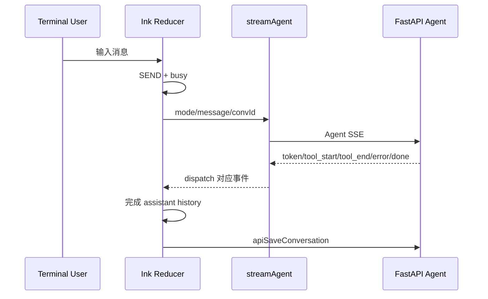

# 07. Vue 前端、API 层与 Ink CLI

## 1. Vue 启动链

```text
frontend/src/main.js
  -> createApp(App)
  -> Pinia
  -> Vue Router
  -> mount
```

根布局 [`frontend/src/App.vue`](../../frontend/src/App.vue) 根据 route meta 选择公开、全屏或侧边栏布局，并按权限决定是否加载 AI 助手浮窗。

## 2. Router 与权限守卫

[`frontend/src/router/index.js`](../../frontend/src/router/index.js) 是页面入口表。阅读一个功能时先记录：

- route path 和 name；
- 懒加载的 View；
- `meta.public`、`meta.fullscreen`；
- 所需模块/动作权限；
- 是否存在重定向或兼容路由。

Router guard 负责用户体验，但后端才是安全边界。直接输入 URL、调用 API 或使用 CLI 都可能绕过侧边栏可见性。

## 3. 根布局与侧边栏

[`frontend/src/components/Sidebar.vue`](../../frontend/src/components/Sidebar.vue) 不只是静态菜单，它还负责：

- 根据当前 route 展开菜单组；
- 根据权限过滤菜单；
- 展示 Loki、Prometheus、SkyWalking、AI 健康状态；
- 主题切换；
- 退出并跳转登录页。

因此“移除一个功能入口”至少要检查：侧边栏、Router、Command Palette、页面内部跳转和残留文案。

## 4. API 层

[`frontend/src/api/index.js`](../../frontend/src/api/index.js) 是 Web 与后端的主要契约层，负责：

- Axios 实例和统一 base URL；
- Cookie/认证错误处理；
- 领域 API 方法；
- SSE 读取与事件解析；
- 文件下载/导出；
- 将后端字段映射为页面所需结构。

推荐始终从页面调用的方法名追到这里，再找对应 HTTP 路由。不要凭页面按钮文案猜后端接口。

## 5. 页面状态模型

大型 View 常同时维护：

```text
查询条件 + 列表数据 + 当前对象 + loading + generating
+ SSE 内容 + 错误/成功消息 + 弹窗状态 + 取消控制器
```

这会产生典型异步竞态：

- 关闭弹窗后，旧请求返回并重新写入状态；
- 快速切换对象时，前一次响应覆盖新对象；
- 页面卸载后 SSE 继续写状态；
- 基础数据完成，但 AI loading 仍阻塞整个页面；
- finally 把另一条新请求的 loading 复位。

解决这类问题的关键是 request sequence、AbortController、对象 ID 校验和拆分 loading 状态。

## 6. Web Agent 页面

Agent UI 需要表达两套状态：

1. 对话状态：会话、消息、token、模型和模式；
2. 工具状态：工具输入、开始、输出、确认、失败。

一个工具调用可能产生多次 SSE 事件，最终答案还可能用 `replace_content` 替换中间文本。渲染模型应按事件类型更新，而不是把所有 data 拼成 Markdown。

## 7. Ink CLI

[`cli/index.mjs`](../../cli/index.mjs) 用 React/Ink 提供终端 UI。核心状态包括：

- `mode`：chat/rca/inspect/guided；
- `hist`：已完成历史；
- `stream`：当前流式消息；
- `busy`、`err`、`notice`；
- `convId`：与 Web 后端共享会话；
- 当前登录用户和 session ID。

### CLI 提交链路



### Slash commands

CLI 内建 `/help`、`/mode`、`/status`、`/reset`、`/clear`、`/logout`、`/exit` 等命令。它们有些只更新本地 reducer，有些访问后端健康或会话接口，阅读时要区分。

### Web/CLI 会话互通

当 assistant 消息落地后，CLI 把非 system 消息和工具记录保存到服务端，标题以 `[CLI]` 标识。会话互通依赖相同 `convId` 和用户会话，并不意味着 Web 与 CLI 的瞬时 UI 状态完全一致。

## 8. API 与页面契约检查

修改或排查一个接口时，至少对齐：

| 层 | 检查项 |
| --- | --- |
| View | 调用参数、loading、空态、错误态 |
| api/index.js | 方法、URL、HTTP method、response 解包 |
| Router | Pydantic schema、权限、状态码、SSE/文件 header |
| Service | 领域字段、默认值、异常语义 |
| Test | 边界输入与回归契约 |

## 9. 常见误判

- 菜单不显示不等于接口不存在，也不等于用户不能调用接口。
- Axios 成功不等于业务数据有效，需检查 response body 的约定。
- SSE 的网络请求一直 pending 通常是正常状态，关键看是否持续收到事件。
- CLI 与 Web 显示不同可能是 reducer 事件处理差异，不一定是后端返回不同。
- `sessionStorage` 是浏览器会话级状态，不是服务端持久化。

## 10. 自检

1. 为什么从产品中移除一个页面时还要搜索 Command Palette？
2. SSE 中 `replace_content` 与 `token` 应如何不同处理？
3. 如何防止先发出的慢请求覆盖后发出的快请求？

