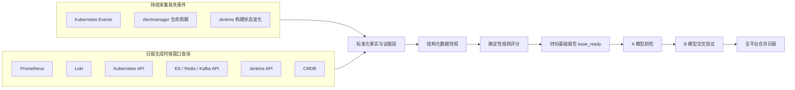
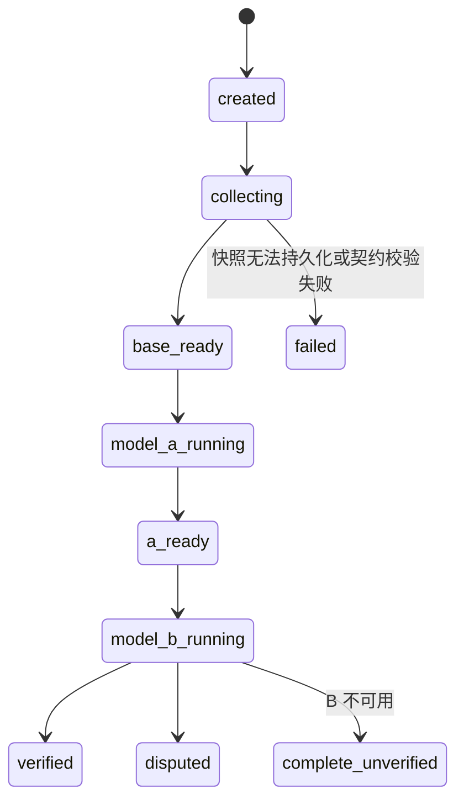

# 全平台滚动 24 小时 SRE 四层日报设计

日期：2026-07-13

状态：设计已逐项确认，等待书面评审

适用项目：`D:\loki-log-analyse`

## 1. 背景

项目已经具备 Loki、Prometheus、Kubernetes、Alertmanager、ES、Redis、Kafka、Jenkins、CMDB 和 AI 分析能力，但现有日报仍存在以下确定性问题：

- 部分统计值来自估算而非真实查询，例如使用错误日志数推算总日志数。
- 部分业务含义被替代，例如用存在错误日志的服务数代替活跃告警数。
- 不同采集器没有统一的时间窗口和数据质量契约。
- Kubernetes Events、告警生命周期等易失数据无法仅靠日报生成时临时查询完整恢复。
- 基础设施、业务接口、告警和日志没有围绕同一实体与同一时间轴建立证据链。
- AI 输出与确定性数据、评分规则和证据引用没有严格隔离。

本设计建立“数据采集 → 结构化事实 → 确定性评分 → A/B 模型校验 → 四份子报告 → 一份合并日报”的闭环。

## 2. 目标

### 2.1 核心目标

1. 每天生成一份全平台滚动 24 小时日报。
2. 日报包含四份可独立查看的子报告：
   - 基础设施报告；
   - 业务指标报告；
   - 告警生命周期报告；
   - 日志证据报告。
3. 四份子报告合并为一份全平台 SRE 日报，并支持按集群、Namespace、工作负载、Pod、服务和接口下钻。
4. 每个数字、异常和 AI 结论均可追溯到实际数据源、查询条件、阈值和证据。
5. 数据缺失不得被解释为正常，模型不得修改确定性事实和规则评分。
6. A 模型完成初检，B 模型使用同一份数据快照进行交叉验证，并保留分歧。

### 2.2 非目标

- 不复制 Prometheus 的全部时序数据。
- 不复制 Loki 的全部原始日志。
- 不让 AI 根据名称相似度猜测服务、Pod、接口、中间件或 Jenkins Job 的关系。
- 不让 AI 自行生成评分阈值或修改健康分。
- 不在本阶段替代现有 Prometheus、Loki、Alertmanager 或 Jenkins 的存储能力。

## 3. 已确认的全局规则

### 3.1 时间窗口

- 日报使用滚动 24 小时窗口。
- `window_end` 每天可配置，默认是北京时间 09:00。
- `window_start = window_end - 24h`。
- 默认时区是 `Asia/Shanghai`。
- 每个 Collector 必须接收同一组 `window_start`、`window_end` 和 `timezone`，不得在内部自行改成“最近一天”或“当前 5 分钟”。
- 报告保存实际使用的时间窗口，确保查询可以复现。

### 3.2 报告范围

- 默认生成一份全平台报告。
- 数据按“集群 → Namespace → 工作负载 → Pod / 服务 / 接口”组织。
- 正文只展示重点异常、重要变更和需处置事项。
- 全量汇总和异常明细通过章节、表格和证据入口下钻。

### 3.3 缺失数据

- 单一数据源失败不阻断整份报告。
- 数据源状态分为：`complete`、`partial`、`unavailable`。
- 无结果、查询失败和指标不存在是三种不同状态，必须分别记录。
- 缺失数据不得按零值或正常值参与分析。
- AI 对缺失数据只能输出“无法判断”或“待验证”，不能输出正常结论。

## 4. 总体架构



### 4.1 混合采集原则

持续保存容易在日报生成前消失或发生状态覆盖的数据：

- Kubernetes Events；
- Alertmanager 触发、人工确认、恢复和状态变化；
- Jenkins 构建开始、结束和状态变化。

在日报生成时查询适合通过时间窗口聚合的数据：

- Prometheus 指标；
- Loki 日志；
- Kubernetes 当前资源拓扑与状态；
- ES、Redis、Kafka 原生状态；
- Jenkins Job、Build 和异常日志；
- CMDB 负责人、机房、对象重要性和依赖关系。

## 5. 确定性实体关系

### 5.1 关系来源优先级

1. Kubernetes `selector` 和 `ownerReference`：Service、Workload、Pod 等集群资源关系。
2. CMDB：负责人、机房、主机、业务依赖、中间件依赖和重要性。
3. 显式 Label、Annotation 或平台配置：业务服务、Jenkins Job 和中间件关联。
4. 无法通过上述来源确认时标记 `unmapped`。

名称相似度不能成为确定性关系。AI 不得把 `unmapped` 对象自动归属到某个服务。

### 5.2 统一实体身份

每条事实和证据按适用范围保存以下身份字段：

- `cluster_id`
- `namespace`
- `resource_kind`
- `resource_name`
- `resource_uid`
- `workload_kind`
- `workload_name`
- `pod_name`
- `container_name`
- `node_name`
- `host_ip`
- `service_name`
- `http_method`
- `route`
- `middleware_type`
- `middleware_instance`
- `jenkins_instance_id`
- `jenkins_job`
- `owner`
- `datacenter`
- `mapping_status`
- `mapping_source`

不适用的字段保持为空，不使用推测值填充。

## 6. 统一数据契约

### 6.1 ReportRun

每次日报生成对应一个不可变的数据快照和一个可更新的分析状态：

```text
report_id
report_type = daily_sre
scope = all_platform
timezone
window_start
window_end
created_at
base_ready_at
status
health_score
health_level
health_score_formal
data_quality_score
section_scores
collector_statuses
model_a_status
model_b_status
verification_status
```

同一 `timezone + window_start + window_end + scope` 生成相同幂等键。重复触发复用已有快照，不重复采集和扣分。

### 6.2 CollectorStatus

每个数据源单独保存：

```text
collector_name
status: complete | partial | unavailable
started_at
finished_at
elapsed_ms
query_count
covered_entities
expected_entities
coverage_ratio
error_type
error_message
query_references
```

错误信息必须脱敏，不能保存密码、Token、Cookie 或完整认证头。

### 6.3 EvidenceRecord

```text
evidence_id
source_type
entity_identity
observed_at
window_start
window_end
metric_name_or_event_type
value
unit
threshold
threshold_source
query
labels
raw_reference
collection_status
mapping_status
```

`raw_reference` 指向原始数据位置或可复现查询，不复制完整原始日志和完整指标序列。

### 6.4 IncidentChain

同一故障只有在存在确定性关系时才能合并：

```text
incident_id
primary_entity
started_at
ended_at
severity
affected_scope
criticality
primary_evidence_id
supporting_evidence_ids
correlation_rule
score_penalty
```

无法证明关联的指标异常、告警和日志保持独立，不由 AI 强行合并。

## 7. 第一份报告：基础设施

### 7.1 Kubernetes

#### Namespace 和 Pod

- Namespace 下 Pod 总数、正常数、异常数和数据覆盖状态。
- Pod 与容器重启增量、发生时间和相关 Events。
- Pod CPU、内存、网络指标的窗口统计和阈值超限持续时间。
- CPU、内存和网络 Top 列表只使用真实指标结果。
- Pod 相关指标告警与 Alertmanager 生命周期关联。
- Pod 异常抖动记录正常/异常状态转换次数及发生区间。
- Pod 漂移按同一工作负载 Pod 重建后跨 Node 调度定义。
- 漂移原因根据 Events、ReplicaSet 变化和节点状态区分滚动发布、驱逐、节点故障等；证据不足时标记原因未知。

#### 工作负载和资源

- Deployments：副本状态、不可用副本、更新状态和 Events。
- DaemonSets：期望、当前、就绪、不可用数量和 Events。
- StatefulSets：副本状态、滚动更新、异常 Pod 和 Events。
- Jobs：成功、失败、活跃状态、执行时长和 Events。
- CronJobs：最近调度、最近成功、最近失败和暂停状态。
- Services：类型、端口、Selector、Endpoints/EndpointSlice 覆盖状态。
- ConfigMaps：名称、Namespace、引用关系、`resourceVersion` 和变更指纹；默认不复制配置值。
- Nodes：Ready 状态、Conditions、资源容量、资源利用率、网络和相关 Events。

### 7.2 服务器

主机表包含：

- IP、主机名、操作系统；
- CPU 核数、总内存、磁盘配置；
- 运行状态、负责人、机房和业务分组；
- CPU 使用率；
- 内存使用率；
- 系统负载；
- 网络流入、流出；
- IO 读取、写入速度；
- TCP 连接数和连接状态。

窗口型指标展示实际可获得的当前值、平均值、最大值、P95 和阈值超限时段。无法计算的统计项显示不可用，不进行估算。

### 7.3 中间件

#### Elasticsearch

- 原生 API：集群状态、节点、索引和分片状态。
- Prometheus Exporter：窗口内的时序指标和异常区间。

#### Redis

- 原生 API：部署模式、集群状态和慢日志记录。
- Prometheus Exporter：连接数、QPS、命中率和窗口趋势。

#### Kafka

- 原生 API：集群状态、Topic、分区数和消费组。
- Prometheus Exporter：可获得的时序状态与异常区间。

原生 API 与 Exporter 结果冲突时同时保存并标记 `conflict`，不由 AI 选择其中一个作为事实。

### 7.4 Jenkins

- 所有 Job 保存运行次数和状态汇总。
- 每次构建保存开始、结束、状态和耗时。
- 失败、不稳定、中止和超时构建保存日志尾部、错误阶段和完整日志链接。
- 成功构建不复制完整控制台日志。
- Jenkins Job 与服务的关系只来自显式配置、Label、Annotation 或 CMDB。

## 8. 第二份报告：业务指标

### 8.1 定量数据来源

- Prometheus 是接口请求量、状态码、QPS 和延迟的主数据源。
- SkyWalking/Trace 和日志只用于调用链、异常时间点和错误证据补充。
- 不同来源的请求数禁止累加。

### 8.2 接口口径

- `2xx/3xx`：成功请求。
- `4xx`：客户端错误，单独统计。
- `5xx`、超时和连接失败：服务端失败。
- 服务端失败率：服务端失败请求数除以总请求数。

每个接口展示：

- 集群和 Namespace；
- 服务；
- HTTP Method 和 Route/URI；
- 协议和端口；
- 接口发现来源；
- 总请求数；
- 成功请求数；
- 4xx 请求数；
- 5xx 请求数；
- 服务端失败请求数和失败率；
- 平均 QPS 和可计算的峰值 QPS；
- 最大、平均和 P95 响应时间；
- 异常时间段；
- 抖动状态和阈值跨越次数；
- 关联 Workload、Pod 和依赖；
- 指标、日志、Trace 和 Pod 证据入口。

### 8.3 微服务接口目录

业务报告提供一级入口“微服务接口目录”。

目录支持按集群、Namespace、服务、Method、Route 和状态筛选。接口只在以下情况进入目录：

- Prometheus 指标序列明确包含服务和 Method/Route 标签；或
- 平台存在显式接口配置和确定性服务映射。

Trace 和日志可以补充已知接口的证据，但不能凭名称创建接口或归属服务。缺少接口指标的服务保留在服务列表，并标记“接口数据不可用”。

## 9. 第三份报告：告警生命周期

### 9.1 时间定义

- 触发时间：Alertmanager `startsAt`。
- 响应时间：运维人员首次确认或认领时间 `acknowledged_at`。
- 恢复时间：Alertmanager resolved 事件的 `endsAt`。
- 人工关闭时间单独记录，不能替代恢复时间。
- MTTA：`acknowledged_at - startsAt`。
- MTTR：`endsAt - startsAt`。
- 没有确认记录显示“未响应”，没有 resolved 事件显示“未恢复”，不填 0。

### 9.2 高频和低频致命告警

- 高频告警：同一稳定告警指纹在滚动 24 小时内重复触发至少 3 次。
- 次数阈值和指纹字段可配置。
- 默认稳定指纹由告警名称、集群、Namespace、稳定对象身份和严重级别组成，排除时间戳、Pod UID、容器 ID 等易变字段。
- 低频致命告警：滚动 24 小时内触发 1–2 次，并且规则明确标记 `critical/P1` 或属于管理员配置的致命告警清单。
- 低频致命告警无论是否恢复都必须展示。

## 10. 第四份报告：日志证据

### 10.1 日志模板与高频关键字

- 日志先进行模板化和稳定指纹归一。
- 归一过程移除时间戳、UUID、Trace ID、Span ID、IP 和动态参数。
- 服务、Namespace、Pod、容器等标签作为维度保留，不从日志正文猜测归属。
- 按模板指纹统计频次、涉及服务、首次时间、最后时间和代表性样本。

### 10.2 报告内容

- 每个异常微服务使用一句话概括错误模式和影响，不以错误日志条数作为结论。
- 展示高频错误关键字和涉及服务。
- 展示特定接口、特定时间的代表性日志。
- 保存 LogQL、时间窗口、标签和样本引用。
- 原始日志继续保留在 Loki，不复制全部日志到报告数据库。

## 11. 抖动和漂移规则

### 11.1 抖动

- 指标先按配置的固定时间粒度聚合。
- 默认规则：连续 30 分钟内正常/异常状态跨越配置阈值至少 3 次。
- 时间窗口、跨越次数和指标阈值均可按指标或服务配置。
- 抖动由规则引擎判定，AI 只解释已判定结果。

### 11.2 Pod 漂移

- Pod 本身不被描述为在 Node 间移动。
- 漂移指同一 Deployment、StatefulSet 等工作负载的 Pod 重建后调度到不同 Node。
- 必须记录旧 Pod、新 Pod、旧 Node、新 Node、发生时间和证据。
- 原因分类必须有 Events、Workload 变更或 Node 状态证据。

## 12. 健康分和数据质量分

### 12.1 两种分数完全分离

- 健康分反映已观测系统状态。
- 数据质量分反映报告覆盖率和证据完整性。
- 数据缺失不直接按健康异常扣分，也不能按正常参与评分。

### 12.2 健康等级

- 健康：90–100。
- 关注：75–89。
- 警告：60–74。
- 严重：低于 60。
- 等级边界允许管理员配置。

### 12.3 正式评级门槛

- 最低数据质量门槛可配置，默认是 70%。
- 低于门槛仍生成报告和参考分。
- 低于门槛时 `health_score_formal = false`，总体状态显示“数据不足，无法正式评级”。
- AI 不得在该状态下输出“系统正常”。

### 12.4 阈值来源

评分阈值按以下优先级取得：

1. 服务级 SLO 或告警规则；
2. 平台中明确配置的默认阈值；
3. 两者均不存在时，只展示数据，不参与扣分。

报告必须记录实际使用的阈值和来源。

### 12.5 扣分和聚合

单个异常扣分由显式评分规则计算：

```text
penalty = base_penalty(severity)
          × duration_factor
          × scope_factor
          × criticality_weight
```

- `base_penalty`、持续时间因子、影响范围因子、对象重要性和扣分上限均来自配置。
- 没有显式评分规则的异常展示在报告中，但不产生任意扣分。
- 同一确定性 IncidentChain 只扣一次，其他指标、告警和日志作为支持证据。
- K8s、服务器、中间件和 Jenkins 的领域权重可配置；未配置时，对有有效数据的领域等权。
- 基础设施、业务、告警和日志四个子报告权重可配置；未配置时，对有有效数据的子报告等权。

分数按以下顺序计算：

```text
entity_score = max(0, 100 - sum(该实体唯一 IncidentChain 的封顶扣分))
domain_score = 有效实体分数按对象重要性加权平均
section_score = 有效领域分数按领域权重加权平均
overall_health_score = 四个有效子报告分数按子报告权重加权平均
```

缺失数据对应的实体或领域不进入健康分的分母，其缺失影响只进入数据质量分。报告必须同时展示参与健康分计算的实体数和被排除的缺失实体数，防止高健康分掩盖低覆盖率。

### 12.6 数据质量分

```text
data_quality_score =
  可用必需观测项权重之和 / 全部必需观测项权重之和 × 100
```

- 必需观测项权重可配置，未配置时等权。
- `partial` 按实际覆盖比例计入。
- `unavailable` 计为 0 覆盖。
- 数据质量详情必须列出缺失的来源、对象和字段。

## 13. A/B 模型协同

### 13.1 SRE 角色约束

两个模型均使用以下原则：

> 你是具有十年一线运维经验的 SRE 专家，擅长 Kubernetes 分析、Python 编程、故障根因分析和问题排查。不得使用假设性数据，不得猜想或臆想。所有结论必须有报告事实和证据支持。

### 13.2 模型选择

- 在智能配置中分别选择 A 模型和 B 模型。
- A、B 必须是不同模型 ID。
- 模型配置沿用现有模型管理和密钥保护能力。

### 13.3 A 模型初检

A 模型接收：

- 同一份不可变数据快照；
- 确定性评分结果；
- IncidentChain；
- EvidenceRecord 索引；
- 数据质量和缺失项。

每条结论必须输出：

```text
claim_id
claim
affected_entities
time_range
evidence_ids
confidence
recommended_action
```

缺少有效 `evidence_ids` 的内容只能进入“待验证项”，不能进入正式结论。

### 13.4 B 模型交叉验证

B 模型使用同一数据快照验证 A 模型的每条结论：

```text
claim_id
verdict: confirmed | rejected | insufficient_evidence
evidence_ids
reason
```

- B 模型不能修改原始事实和规则评分。
- A/B 分歧完整保留，状态标记 `disputed`，需要人工确认。
- 不自动调用第三模型投票。
- B 模型不可用时基础报告照常发布，A 模型结论标记“未经交叉验证”。

## 14. 报告生成状态机



- Collector 的部分失败通过 `collector_statuses` 和数据质量表达，不把 ReportRun 置为 `failed`。
- `base_ready` 表示四份基础报告、规则评分和覆盖率已经保存并可查看。
- A/B 分析在 `base_ready` 后异步执行。
- 模型重试必须复用同一数据快照。

## 15. 存储设计

### 15.1 沿用现有模式

项目当前使用 SQLite 保存报告元数据、JSON 文件保存报告正文。本设计沿用该模式：

- SQLite：报告列表、窗口、状态、分数、覆盖率和模型状态等快速索引。
- JSON：完整四层快照、评分明细、接口目录、采集状态、AI 输出和分歧。

### 15.2 新增持久化边界

- 通过增量数据库迁移扩展现有 `report_meta`，保存 ReportRun 的时间窗口、状态、数据质量分、子报告分数和 A/B 状态；不替换现有表，也不破坏旧报告查询。
- `event_record`：K8s Events、告警生命周期和 Jenkins 构建状态变化。
- `report_evidence_index`：报告内证据的快速查询索引。
- 完整报告仍保存为 `reports/{report_id}.json`。

报告快照保存复查所需的结构化事件和证据引用，因此原始易失事件可继续遵循平台现有报告保留策略。密码、Token、Cookie、Secret 和完整认证头不得进入报告文件。

## 16. 页面结构

### 16.1 合并日报

顶部展示：

- 报告时间窗口和时区；
- 全平台范围；
- 系统健康分和是否为正式评级；
- 数据质量分；
- A/B 模型状态；
- AI 执行结论；
- 滚动 24 小时跨层异常时间线。

一级章节：

1. 总览；
2. 基础设施；
3. 业务指标；
4. 告警；
5. 日志；
6. 数据质量。

### 16.2 微服务接口目录

业务章节提供一级入口“微服务接口目录”，支持：

- 服务列表；
- 接口表；
- 集群、Namespace、服务、Method、Route 和状态筛选；
- 指标、日志、Trace、Workload 和 Pod 下钻；
- 未映射服务和无接口指标服务的明确分组。

## 17. API 边界

在现有报告 Router 中新增兼容性接口，不删除现有日报、巡检和慢日志接口：

```text
POST /api/reports/daily-runs
GET  /api/reports/daily-runs/{report_id}
GET  /api/reports/daily-runs/{report_id}/status
GET  /api/reports/daily-runs/{report_id}/sections/{section}
GET  /api/reports/daily-runs/{report_id}/interfaces
GET  /api/reports/daily-runs/{report_id}/evidence/{evidence_id}
GET  /api/reports/daily-config
PUT  /api/reports/daily-config
```

前端可以通过现有 SSE 约定接收 `base_ready`、A 模型、B 模型和最终状态更新。基础结果的可见性不能依赖 AI 流完成。

## 18. 错误处理

- 每个 Collector 独立设置可配置超时和有限重试。
- Collector 失败记录来源、错误类型、耗时、查询条件和影响范围。
- 数据源返回无结果、请求失败和指标不存在分别处理。
- 实体映射冲突保留双方证据并标记 `conflict`。
- EvidenceRecord 契约校验失败时拒绝该条证据，不污染其他来源。
- A/B 输出必须通过结构校验和证据 ID 校验。
- 模型引用不存在的证据时，对应结论作废并记录校验错误。
- 基础报告保存成功后才启动模型任务；模型失败不回滚基础报告。
- 同一时间窗口和范围使用幂等键，防止并发生成重复报告。

## 19. 测试设计

### 19.1 单元测试

- 滚动 24 小时时间窗口及时区。
- 接口成功、4xx、5xx、失败率、QPS 和延迟公式。
- 告警指纹、高频告警、低频致命告警、MTTA 和 MTTR。
- 日志模板化和动态字段归一。
- Pod 重启、漂移原因分类和抖动检测。
- IncidentChain 去重扣分。
- 健康分、数据质量分和 70% 正式评级门槛。
- A/B 输出结构和证据引用校验。

### 19.2 集成测试

- Prometheus、Loki、Kubernetes、Alertmanager、ES、Redis、Kafka 和 Jenkins 全部成功。
- 单一 Collector 失败。
- 多个 Collector 部分成功。
- 原生中间件 API 与 Exporter 冲突。
- CMDB 与 K8s 显式关系冲突。
- A 模型成功、B 模型失败。
- A/B 模型结论分歧。

### 19.3 端到端测试

- 定时生成和手动生成使用相同窗口契约。
- `base_ready` 在 AI 完成前可见。
- 四份子报告和合并报告均可打开。
- 微服务接口目录可以筛选和下钻。
- 每个结论能打开对应证据。
- 重复触发同一窗口不会生成重复报告。
- 现有运维日报、主机巡检日报、慢日志报告和报告列表保持可用。

## 20. 验收标准

1. 所有 Collector 使用同一个滚动 24 小时时间窗口。
2. 报告中不再估算总日志数，也不再使用错误服务数代替告警数。
3. 每个数字都可以查看数据源、查询条件、阈值和统计公式。
4. 缺失数据不显示为正常。
5. 数据质量低于默认 70% 时不输出正式健康评级。
6. 四份基础报告不等待 AI 即可查看。
7. A/B 模型不能修改确定性事实和规则评分。
8. A/B 分歧完整保留并标记需要人工确认。
9. 微服务接口目录可以下钻到指标、日志、Trace、Workload 和 Pod。
10. 同一故障只有在确定性关联成立时合并，并且只扣一次分。
11. Alertmanager 的确认和恢复事件可以计算 MTTA 和 MTTR。
12. K8s Events、告警生命周期和 Jenkins 构建状态不会因日报生成时间而丢失。
13. 报告文件和数据库中不包含明文密码、Token、Cookie 或 Secret。

## 21. 交付拆分

该功能按依赖顺序拆成五个可独立验证的实施阶段：

1. 数据契约、ReportRun 状态机、事件存储和兼容性迁移。
2. K8s、主机、中间件、Jenkins、告警、业务指标和日志 Collector。
3. 确定性关联、IncidentChain、评分引擎和四份基础报告。
4. A/B 模型异步初检、复核、证据校验和分歧状态。
5. 合并日报页面、微服务接口目录、证据下钻、定时任务和端到端验收。

每个阶段完成后必须通过对应测试和真实数据验证，再进入下一阶段。
