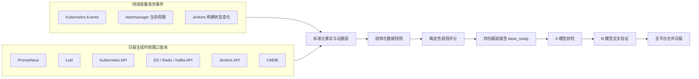
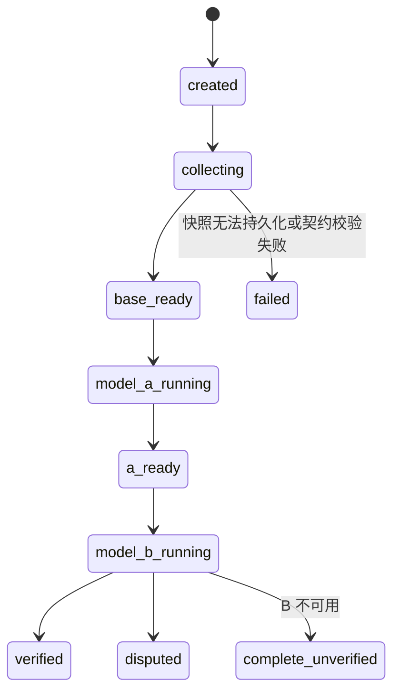

# 全平台滚动 24 小时 SRE 四层日报设计

初版日期：2026-07-13

修订日期：2026-07-22

状态：方案 B + Java 指标异常 RCA 扩展版已完成，等待用户书面评审

适用项目：`D:\loki-log-analyse`

## 1. 背景

项目已经具备 Loki、Prometheus、Kubernetes、Alertmanager、ES、Redis、Kafka、Jenkins、CMDB 和 AI 分析能力，但现有日报仍存在以下确定性问题：

- 部分统计值来自估算而非真实查询，例如使用错误日志数推算总日志数。
- 部分业务含义被替代，例如用存在错误日志的服务数代替活跃告警数。
- 不同采集器没有统一的时间窗口和数据质量契约。
- Kubernetes Events、告警生命周期等易失数据无法仅靠日报生成时临时查询完整恢复。
- 基础设施、业务接口、告警和日志没有围绕同一实体与同一时间轴建立证据链。
- AI 输出与确定性数据、评分规则和证据引用没有严格隔离。

本设计建立“数据采集 → 结构化事实 → 确定性评分 → A/B 模型校验 → 四份子报告 → 一份合并日报”的闭环。

## 2. 目标

### 2.1 核心目标

1. 每天生成一份全平台滚动 24 小时日报。
2. 日报包含四份可独立查看的子报告：
   - 基础设施报告；
   - 业务指标报告；
   - 告警生命周期报告；
   - 日志证据报告。
3. 四份子报告合并为一份全平台 SRE 日报，并支持按项目 ID、集群、Namespace、工作负载、Pod、服务和接口下钻。
4. 每个数字、异常和 AI 结论均可追溯到实际数据源、查询条件、阈值和证据。
5. 数据缺失不得被解释为正常，模型不得修改确定性事实和规则评分。
6. A 模型完成初检，B 模型使用同一份数据快照进行交叉验证，并保留分歧。
7. 一期优先用 P0 数据源跑通“采集、证据、评分、四层报告、下钻”的纵向闭环，再扩展 P1/P2 数据源。
8. 对 Java 指标异常支持从 Prometheus/JMX 暴露端口发现目标，按 Alertmanager 告警时间采集 JVM、Heap、Thread、JFR、指标、日志和源码证据，并生成有证据约束的根因报告。

### 2.2 非目标

- 不复制 Prometheus 的全部时序数据。
- 不复制 Loki 的全部原始日志。
- 不让 AI 根据名称相似度猜测服务、Pod、接口、中间件或 Jenkins Job 的关系。
- 不让 AI 自行生成评分阈值或修改健康分。
- 不在本阶段替代现有 Prometheus、Loki、Alertmanager 或 Jenkins 的存储能力。
- 不默认执行完整 Heap Dump 或深度对象引用链分析；这类高风险诊断必须由人工确认。
- 不把当前仓库 `HEAD` 当作线上服务源码版本，源码根因必须绑定部署镜像、构建号或 Git commit。

## 3. 已确认的全局规则

### 3.1 时间窗口

- 日报使用滚动 24 小时窗口。
- `window_end` 每天可配置，默认是北京时间 09:00。
- `window_start = window_end - 24h`。
- 默认时区是 `Asia/Shanghai`。
- 每个 Collector 必须接收同一组 `window_start`、`window_end` 和 `timezone`，不得在内部自行改成“最近一天”或“当前 5 分钟”。
- 报告保存实际使用的时间窗口，确保查询可以复现。

### 3.2 报告范围

- 默认生成一份全平台报告。
- 数据按“项目 ID → 集群 → Namespace → 工作负载 → Pod / 服务 / 接口”组织。
- 正文只展示重点异常、重要变更和需处置事项。
- 全量汇总和异常明细通过章节、表格和证据入口下钻。

### 3.3 缺失数据

- 单一数据源失败不阻断整份报告。
- 数据源状态分为：`complete`、`partial`、`unavailable`。
- 无结果、查询失败和指标不存在是三种不同状态，必须分别记录。
- 缺失数据不得按零值或正常值参与分析。
- AI 对缺失数据只能输出“无法判断”或“待验证”，不能输出正常结论。

每次采集除 `complete | partial | unavailable` 覆盖状态外，还必须保存结果语义：

- `data`：查询成功且存在可用数据；
- `empty`：查询成功但窗口内无记录；
- `metric_missing`：目标存在，但所需指标或标签不存在；
- `query_failed`：数据源请求、鉴权、超时或解析失败。

### 3.4 数据源优先级与一期范围

数据源按对四层报告闭环的重要性分级：

- P0：Kubernetes API/Events、Prometheus、Loki、Alertmanager、CMDB；
- P1：Jenkins、Elasticsearch、Redis、Kafka；
- P2：SkyWalking/Trace 等补充证据源。

一期采用“契约优先 + P0 纵向闭环”：先用 P0 数据源形成可追溯、可评分、可下钻的完整报告。P1 Collector 必须遵循同一契约，可在一期报告中正确显示 `partial/unavailable`，但 P1 未完成不得阻断 P0 报告发布。P2 只补充调用链和根因证据，不作为业务请求量的主统计来源。

Java 指标异常 RCA 的范围采用同一分级：P0 只覆盖 Kubernetes 中可确定映射的 Java Pod；P1 再覆盖 VM Java 进程，但必须复用同一套 `JavaTarget` 身份契约，不得使用“最高 RSS 进程”等启发式规则自动选目标。

## 4. 总体架构



### 4.1 混合采集原则

持续保存容易在日报生成前消失或发生状态覆盖的数据：

- Kubernetes Events；
- Alertmanager 触发、人工确认、恢复和状态变化；
- Jenkins 构建开始、结束和状态变化。

在日报生成时查询适合通过时间窗口聚合的数据：

- Prometheus 指标；
- Loki 日志；
- Kubernetes 当前资源拓扑与状态；
- ES、Redis、Kafka 原生状态；
- Jenkins Job、Build 和异常日志；
- CMDB 负责人、机房、对象重要性和依赖关系。

### 4.2 观测事实类型

每条 EvidenceRecord 必须声明 `observation_kind`，避免把当前快照误写成 24 小时统计：

| 类型 | 含义 | 示例 |
|---|---|---|
| `snapshot` | `window_end` 附近的当前状态 | Node Ready、Deployment 当前副本、ES 当前集群状态 |
| `timeseries` | 窗口内可聚合的时序数据 | CPU、内存、QPS、请求数、P95 |
| `event` | 有明确发生时间的离散事件 | K8s Event、Pod 重建、Jenkins Build 失败 |
| `lifecycle` | 有触发、变化和结束阶段的事件 | 告警触发、确认、恢复 |

快照只能表述“窗口结束时状态”，不得推导为“过去 24 小时一直如此”。窗口结论必须来自 `timeseries`、`event` 或 `lifecycle` 事实。

### 4.3 数据源主责矩阵

同一统计字段只允许一个主数据源负责计算，其他数据源只能补充证据：

| 数据域 | 主数据源 | 主责内容 | 补充数据源 |
|---|---|---|---|
| Kubernetes | Kubernetes API + 持续 Events | 资源状态、归属关系、重启、调度和事件 | Prometheus 资源指标、Alertmanager 告警 |
| 业务接口 | Prometheus | 请求量、状态码、QPS、延迟和分位数 | Trace/Loki 补充调用链和错误样本 |
| 日志 | Loki | 日志计数、模板、关键字和代表样本 | Kubernetes/CMDB 补充确定性身份 |
| 告警 | Alertmanager + 明确认领源 | 触发、恢复、确认和生命周期 | 工单/平台操作记录补充响应动作 |
| Java 运行时 | Prometheus/JMX Exporter + 受控诊断工具 | JVM 指标、Heap/Thread/JFR 证据和诊断产物 | Loki/Trace/源码版本补充接口和代码证据 |
| 中间件 | 原生 API | 集群、节点、索引、分片、Topic、消费组等状态 | Exporter 提供窗口指标 |
| Jenkins | Jenkins API | Job、Build、状态、耗时和日志入口 | CMDB/显式配置提供服务映射 |

禁止对来自不同主数据源的请求数、告警数或日志数进行累加。主数据源不可用时保存缺失状态，不使用补充数据源生成替代数字。

## 5. 确定性实体关系

### 5.1 关系来源优先级

1. Kubernetes `selector` 和 `ownerReference`：Service、Workload、Pod 等集群资源关系。
2. CMDB：项目 ID、负责人、机房、主机、业务依赖、中间件依赖和重要性。
3. 显式 Label、Annotation 或平台配置：项目 ID、业务服务、Jenkins Job 和中间件关联。
4. 无法通过上述来源确认时标记 `unmapped`。

名称相似度不能成为确定性关系。AI 不得把 `unmapped` 对象自动归属到某个服务。

### 5.2 统一实体身份

每条事实和证据按适用范围保存以下身份字段：

- `entity_type`
- `entity_key`
- `project_id`
- `project_name`
- `cluster_id`
- `namespace`
- `resource_kind`
- `resource_name`
- `resource_uid`
- `workload_kind`
- `workload_name`
- `pod_name`
- `container_name`
- `node_name`
- `host_ip`
- `prometheus_target`
- `jvm_pid`
- `image_digest`
- `build_id`
- `source_revision`
- `service_name`
- `http_method`
- `route`
- `middleware_type`
- `middleware_instance`
- `jenkins_instance_id`
- `jenkins_job`
- `owner`
- `datacenter`
- `mapping_status`
- `mapping_source`

不适用的字段保持为空，不使用推测值填充。

`entity_type` 使用受控枚举，例如 `cluster | namespace | workload | pod | container | node | host | service | interface | java_target | middleware | jenkins_job | alert`。`entity_key` 是由确定性稳定字段生成的规范键；有 Kubernetes UID 时优先使用 UID，无 UID 时使用经过版本化规则拼接的稳定字段。实体关系、去重和关联不得依赖展示名称。

### 5.3 项目维度规则

- `project_id` 是项目维度的稳定主键，`project_name` 仅用于展示，不能代替 ID 参与关联。
- `project_id` 只能来自 CMDB、显式 Label、Annotation 或平台映射配置。
- 同名项目、服务或 Namespace 不能作为项目归属证据。
- 无法确认项目归属时，`project_id` 保持为空且 `mapping_status = unmapped`，页面统一归入“未关联项目”。
- ReportRun、EvidenceRecord、IncidentChain、四份子报告、接口目录、告警和日志聚合均携带 `project_id`。
- 全平台报告允许按一个或多个 `project_id` 筛选，也允许查看全部项目。

## 6. 统一数据契约

### 6.1 ReportRun

每次日报生成对应一个不可变的数据快照和一个可更新的分析状态：

```text
report_id
report_type = daily_sre
contract_version
scoring_rule_version
scope_type = all_platform | projects
project_ids
timezone
window_start
window_end
created_at
base_ready_at
status
health_score
health_level
health_score_formal
data_quality_score
section_scores
collector_statuses
model_a_status
model_b_status
verification_status
```

同一 `timezone + window_start + window_end + scope_type + 排序后的 project_ids` 生成相同幂等键。`scope_type = all_platform` 时 `project_ids` 为空；`scope_type = projects` 时必须提供至少一个稳定项目 ID。重复触发复用已有快照，不重复采集和扣分。

### 6.2 CollectorStatus

每个数据源单独保存：

```text
collector_name
status: complete | partial | unavailable
started_at
finished_at
elapsed_ms
query_count
covered_entities
expected_entities
coverage_ratio
error_type
error_message
query_references
```

错误信息必须脱敏，不能保存密码、Token、Cookie 或完整认证头。

### 6.3 EvidenceRecord

```text
evidence_id
source_type
observation_kind: snapshot | timeseries | event | lifecycle
result_status: data | empty | metric_missing | query_failed
entity_identity
observed_at
window_start
window_end
metric_name_or_event_type
value
unit
threshold
threshold_source
formula
query
labels
raw_reference
collection_status
mapping_status
```

`raw_reference` 指向原始数据位置或可复现查询，不复制完整原始日志和完整指标序列。

`formula` 保存请求数、失败率、QPS、分位数和评分项实际使用的统计公式。无法复现公式或查询的数值不得进入正式评分。

### 6.4 IncidentChain

同一故障只有在存在确定性关系时才能合并：

```text
incident_id
primary_entity
started_at
ended_at
severity
affected_scope
criticality
primary_evidence_id
supporting_evidence_ids
correlation_rule
score_penalty
```

无法证明关联的指标异常、告警和日志保持独立，不由 AI 强行合并。

## 7. 第一份报告：基础设施

### 7.1 Kubernetes

#### Namespace 和 Pod

- Namespace 下 Pod 总数、正常数、异常数和数据覆盖状态。
- Pod 与容器重启增量、发生时间和相关 Events。
- Pod CPU、内存、网络指标的窗口统计和阈值超限持续时间。
- CPU、内存和网络 Top 列表只使用真实指标结果。
- Pod 相关指标告警与 Alertmanager 生命周期关联。
- Pod 异常抖动记录正常/异常状态转换次数及发生区间。
- Pod 漂移按同一工作负载 Pod 重建后跨 Node 调度定义。
- 漂移原因根据 Events、ReplicaSet 变化和节点状态区分滚动发布、驱逐、节点故障等；证据不足时标记原因未知。

#### 工作负载和资源

- Deployments：副本状态、不可用副本、更新状态和 Events。
- DaemonSets：期望、当前、就绪、不可用数量和 Events。
- StatefulSets：副本状态、滚动更新、异常 Pod 和 Events。
- Jobs：成功、失败、活跃状态、执行时长和 Events。
- CronJobs：最近调度、最近成功、最近失败和暂停状态。
- Services：类型、端口、Selector、Endpoints/EndpointSlice 覆盖状态。
- ConfigMaps：名称、Namespace、引用关系、`resourceVersion` 和变更指纹；默认不复制配置值。
- Nodes：Ready 状态、Conditions、资源容量、资源利用率、网络和相关 Events。

### 7.2 服务器

主机表包含：

- IP、主机名、操作系统；
- CPU 核数、总内存、磁盘配置；
- 运行状态、负责人、机房和业务分组；
- CPU 使用率；
- 内存使用率；
- 系统负载；
- 网络流入、流出；
- IO 读取、写入速度；
- TCP 连接数和连接状态。

窗口型指标展示实际可获得的当前值、平均值、最大值、P95 和阈值超限时段。无法计算的统计项显示不可用，不进行估算。

### 7.3 中间件

#### Elasticsearch

- 原生 API：集群状态、节点、索引和分片状态。
- Prometheus Exporter：窗口内的时序指标和异常区间。

#### Redis

- 原生 API：部署模式、集群状态和慢日志记录。
- Prometheus Exporter：连接数、QPS、命中率和窗口趋势。

#### Kafka

- 原生 API：集群状态、Topic、分区数和消费组。
- Prometheus Exporter：可获得的时序状态与异常区间。

原生 API 与 Exporter 结果冲突时同时保存并标记 `conflict`，不由 AI 选择其中一个作为事实。

### 7.4 Jenkins

- 所有 Job 保存运行次数和状态汇总。
- 每次构建保存开始、结束、状态和耗时。
- 失败、不稳定、中止和超时构建保存日志尾部、错误阶段和完整日志链接。
- 成功构建不复制完整控制台日志。
- Jenkins Job 与服务的关系只来自显式配置、Label、Annotation 或 CMDB。

## 8. 第二份报告：业务指标

### 8.1 定量数据来源

- Prometheus 是接口请求量、状态码、QPS 和延迟的主数据源。
- SkyWalking/Trace 和日志只用于调用链、异常时间点和错误证据补充。
- 不同来源的请求数禁止累加。
- Prometheus 查询成功但没有序列、目标指标不存在和查询失败必须分别显示为 `empty`、`metric_missing` 和 `query_failed`。

### 8.2 接口口径

- `2xx/3xx`：成功请求。
- `4xx`：客户端错误，单独统计。
- `5xx`、超时和连接失败：服务端失败。
- 服务端失败率：服务端失败请求数除以总请求数。
- P95 仅在存在可计算的直方图桶、摘要分位数或平台明确支持的分位数序列时输出；不能从平均值或最大值估算。
- 接口没有稳定 Method/Route 标签时只能聚合到服务级，不创建推测接口。

每个接口展示：

- 集群和 Namespace；
- 项目 ID；
- 服务；
- HTTP Method 和 Route/URI；
- 协议和端口；
- 接口发现来源；
- 总请求数；
- 成功请求数；
- 4xx 请求数；
- 5xx 请求数；
- 服务端失败请求数和失败率；
- 平均 QPS 和可计算的峰值 QPS；
- 最大、平均和 P95 响应时间；
- 异常时间段；
- 抖动状态和阈值跨越次数；
- 关联 Workload、Pod 和依赖；
- 指标、日志、Trace 和 Pod 证据入口。

### 8.3 微服务接口目录

业务报告提供一级入口“微服务接口目录”。

目录支持按项目 ID、集群、Namespace、服务、Method、Route 和状态筛选。接口只在以下情况进入目录：

- Prometheus 指标序列明确包含服务和 Method/Route 标签；或
- 平台存在显式接口配置和确定性服务映射。

Trace 和日志可以补充已知接口的证据，但不能凭名称创建接口或归属服务。缺少接口指标的服务保留在服务列表，并标记“接口数据不可用”。

## 9. 第三份报告：告警生命周期

### 9.1 时间定义

- 触发时间：Alertmanager `startsAt`。
- 响应时间：运维人员首次确认或认领时间 `acknowledged_at`。
- 恢复时间：Alertmanager resolved 事件的 `endsAt`。
- 人工关闭时间单独记录，不能替代恢复时间。
- MTTA：`acknowledged_at - startsAt`。
- MTTR：`endsAt - startsAt`。
- 没有确认记录显示“未响应”，没有 resolved 事件显示“未恢复”，不填 0。

`acknowledged_at` 只能来自明确的认领或确认记录，例如平台确认操作、告警工单或集成系统回传；同时保存 `acknowledgement_source` 和操作者标识。仅发送通知、打开报告或人工关闭告警不能视为确认。未接入确认数据源时，报告必须显示“确认数据源未接入”，不得计算 MTTA。

### 9.2 高频和低频致命告警

- 高频告警：同一稳定告警指纹在滚动 24 小时内重复触发至少 3 次。
- 次数阈值和指纹字段可配置。
- 默认稳定指纹由项目 ID、告警名称、集群、Namespace、稳定对象身份和严重级别组成，排除时间戳、Pod UID、容器 ID 等易变字段。
- 低频致命告警：滚动 24 小时内触发 1–2 次，并且规则明确标记 `critical/P1` 或属于管理员配置的致命告警清单。
- 低频致命告警无论是否恢复都必须展示。

## 10. 第四份报告：日志证据

### 10.1 日志模板与高频关键字

- 日志先进行模板化和稳定指纹归一。
- 归一过程移除时间戳、UUID、Trace ID、Span ID、IP 和动态参数。
- 项目 ID、服务、Namespace、Pod、容器等确定性标签作为维度保留，不从日志正文猜测归属。
- 按模板指纹统计频次、涉及服务、首次时间、最后时间和代表性样本。

### 10.2 报告内容

- 每个异常微服务使用一句话概括错误模式和影响，不以错误日志条数作为结论。
- 展示高频错误关键字和涉及服务。
- 展示特定接口、特定时间的代表性日志。
- 保存 LogQL、时间窗口、标签和样本引用。
- 原始日志继续保留在 Loki，不复制全部日志到报告数据库。

## 11. 抖动和漂移规则

### 11.1 抖动

- 指标先按配置的固定时间粒度聚合。
- 默认规则：连续 30 分钟内正常/异常状态跨越配置阈值至少 3 次。
- 时间窗口、跨越次数和指标阈值均可按指标或服务配置。
- 抖动由规则引擎判定，AI 只解释已判定结果。

### 11.2 Pod 漂移

- Pod 本身不被描述为在 Node 间移动。
- 漂移指同一 Deployment、StatefulSet 等工作负载的 Pod 重建后调度到不同 Node。
- 必须记录旧 Pod、新 Pod、旧 Node、新 Node、发生时间和证据。
- 原因分类必须有 Events、Workload 变更或 Node 状态证据。

## 12. 健康分和数据质量分

### 12.1 两种分数完全分离

- 健康分反映已观测系统状态。
- 数据质量分反映报告覆盖率和证据完整性。
- 数据缺失不直接按健康异常扣分，也不能按正常参与评分。

### 12.2 健康等级

- 健康：90–100。
- 关注：75–89。
- 警告：60–74。
- 严重：低于 60。
- 等级边界允许管理员配置。

### 12.3 正式评级门槛

- 最低数据质量门槛可配置，默认是 70%。
- 低于门槛仍生成报告和参考分。
- 低于门槛时 `health_score_formal = false`，总体状态显示“数据不足，无法正式评级”。
- AI 不得在该状态下输出“系统正常”。

### 12.4 阈值来源

评分阈值按以下优先级取得：

1. 服务级 SLO 或告警规则；
2. 平台中明确配置的默认阈值；
3. 两者均不存在时，只展示数据，不参与扣分。

报告必须记录实际使用的阈值和来源。

每次报告同时保存 `scoring_rule_version` 和阈值配置快照。后续修改评分规则不得重写历史报告；需要重算时生成新的报告版本，并明确标记使用的新规则版本。

### 12.5 扣分和聚合

单个异常扣分由显式评分规则计算：

```text
penalty = base_penalty(severity)
          × duration_factor
          × scope_factor
          × criticality_weight
```

- `base_penalty`、持续时间因子、影响范围因子、对象重要性和扣分上限均来自配置。
- 没有显式评分规则的异常展示在报告中，但不产生任意扣分。
- 同一确定性 IncidentChain 只扣一次，其他指标、告警和日志作为支持证据。
- K8s、服务器、中间件和 Jenkins 的领域权重可配置；未配置时，对有有效数据的领域等权。
- 基础设施、业务、告警和日志四个子报告权重可配置；未配置时，对有有效数据的子报告等权。
- 每个项目 ID 独立计算四个子报告分和项目健康分；全平台健康分再按配置的项目重要性聚合，未配置项目重要性时对有效项目等权。

分数按以下顺序计算：

```text
entity_score = max(0, 100 - sum(该实体唯一 IncidentChain 的封顶扣分))
domain_score = 有效实体分数按对象重要性加权平均
section_score = 有效领域分数按领域权重加权平均
overall_health_score = 四个有效子报告分数按子报告权重加权平均
```

缺失数据对应的实体或领域不进入健康分的分母，其缺失影响只进入数据质量分。报告必须同时展示参与健康分计算的实体数和被排除的缺失实体数，防止高健康分掩盖低覆盖率。

### 12.6 数据质量分

```text
data_quality_score =
  可用必需观测项权重之和 / 全部必需观测项权重之和 × 100
```

- 必需观测项权重可配置，未配置时等权。
- `partial` 按实际覆盖比例计入。
- `unavailable` 计为 0 覆盖。
- 数据质量详情必须列出缺失的来源、对象和字段。

## 13. Java 指标异常 RCA 扩展

### 13.1 触发范围

Java 指标异常 RCA 接入现有 Alertmanager webhook 和结构化 RCA 流程，不另建绕过告警中心的分析入口。触发来源分为两类：

- 真实告警：来自 Prometheus/Alertmanager，必须保留原始 labels、annotations、`startsAt`、`endsAt`、fingerprint 和 generator URL。
- 演练告警：只允许在显式启用的测试环境生成 Alertmanager 兼容 payload，必须携带 `synthetic=true`、`env`、`cluster`、`namespace`、`workload`、`service`、`severity` 和稳定演练 ID；默认不进入生产通知和健康分。

演练告警用于验证“Prometheus 指标异常 -> Alertmanager webhook -> AIOps 证据采集 -> RCA 报告”的链路，不向生产 Prometheus 写入伪造时序，不把演练数据计入日报正式健康分。

### 13.2 JavaTarget 身份契约

平台通过 Prometheus `/api/v1/targets` 的 activeTargets、target labels、JMX Exporter 暴露的 JVM 指标和 Kubernetes 元数据发现 Java 暴露端口。发现结果不能直接进入诊断，必须先归一为 `JavaTarget`。

每个可诊断 Java 目标必须先解析为 `JavaTarget`：

```text
java_target_id
scope: k8s_pod | vm_process
cluster_id
namespace
workload_kind
workload_name
pod_uid
pod_name
container_name
prometheus_target
prometheus_job
jmx_exporter_port
jvm_pid
host_ip
image
image_digest
build_id
source_revision
mapping_status: mapped | ambiguous | unmapped | conflict
mapping_source
```

P0 只自动处理 `scope = k8s_pod` 且 `mapping_status = mapped` 的目标。映射来源优先级是 Kubernetes UID/ownerReference、Prometheus target labels、容器 `imageID`/digest、显式 Annotation/Label、CMDB 或构建元数据。多个 JVM、多个容器或多个 Prometheus target 无法唯一对应时，自动诊断停止并输出 `ambiguous`，不得选择 RSS 最大进程作为事实目标。

VM Java 进程在 P1 进入，但必须使用同一 `JavaTarget` 字段；只能通过 CMDB、进程启动参数、Prometheus instance、端口和构建元数据建立确定性关系。

### 13.3 证据窗口

Java RCA 的主时间锚点是 Alertmanager `startsAt`。所有可窗口化证据默认查询：

```text
evidence_window_start = startsAt - 5m
evidence_window_end = startsAt + 5m
```

如果触发时 `startsAt + 5m` 尚未到达，RCA 先发布 `partial` 结果，记录已完成证据和缺失的后半窗口，并调度补采任务在窗口结束后补齐。任何“告警前后 5 分钟”的结论必须引用该固定窗口的证据 ID；使用相对 `hours` 或“最近几分钟”只能作为兼容字段，不进入正式归因。

### 13.4 自动与受控诊断策略

采用策略 B：

- 自动采集低风险证据：Prometheus/JMX range 指标、HTTP 接口指标、Pod 资源指标、Kubernetes Events、Loki 日志上下文、Alertmanager 生命周期和部署元数据。
- JFR、Arthas 和 Heap Histogram 只在策略允许时自动执行：环境必须在 allowlist，告警严重级别达到阈值，目标映射唯一，单目标互斥锁可获得，总并发未超过限制，命令超时和采样时长在配置上限内。
- 默认 JFR 为短时有界采样，只保存摘要和 artifact 引用；不得把完整二进制内容发送给模型。
- Heap Histogram 只保存 Top 类、实例数、浅堆大小和命令元数据；不得等同于对象引用链。
- 完整 Heap Dump、深度对象引用链、MAT/OQL 分析和可能造成明显停顿或磁盘压力的操作必须人工确认，并记录确认人、原因、超时、输出位置和清理策略。

诊断策略必须可配置，且默认线上环境关闭 intrusive 操作。所有诊断 artifact 需要脱敏、大小限制、保留期和访问控制。

Thread 证据分两级处理：线程数、daemon 线程数、死锁计数等 JMX/Prometheus 指标属于低风险自动证据；线程栈、busy thread、blocked thread 等需要 attach 到目标 JVM 的采样必须走 Arthas 策略门禁。

### 13.5 异常接口、异常类和源码定位

异常接口只能来自以下证据：

- Prometheus HTTP 指标中的稳定 `method`、`route/uri`、`status`、`application/service` 标签；
- Trace span 中的 endpoint、状态和时间范围；
- 日志结构化字段中的 path、method、trace_id 或 request_id；
- 平台显式接口目录。

异常类只能来自日志异常栈、JFR 事件、Arthas/thread 输出或源码符号命中。源码定位必须先用 `image_digest`、`build_id` 或 `source_revision` 找到部署版本；无法确认部署版本时，当前仓库检索只能进入“候选线索”，不能作为根因事实。

对象引用链只有在人工批准 Heap Dump 并完成可信分析后才能输出。没有这类证据时，报告必须写明“对象引用链未采集或未验证”，不得用 Heap Histogram Top 类推断引用链。

### 13.6 RCA 报告输出契约

Java RCA 报告至少包含：

- 告警时间、证据窗口、目标 `JavaTarget` 和映射状态；
- 异常接口、错误率、延迟、QPS、JVM/Heap/GC/Thread/JFR 证据摘要；
- 告警前后 5 分钟的指标变化、关键日志、K8s Events 和部署变更；
- 异常类、源码文件、版本信息和代码证据；
- 已确认根因、待验证假设、证据缺口和下一步操作；
- 每条根因结论的 `claim_id`、`evidence_ids`、置信度和人工确认状态。

AI 只能基于 EvidenceRecord、JavaTarget 和诊断 artifact 元数据生成结论。没有证据 ID 的接口、类、对象引用链或源码归因只能列入“待验证项”，不能进入正式根因。

## 14. A/B 模型协同

### 14.1 SRE 角色约束

两个模型均使用以下原则：

> 你是具有十年一线运维经验的 SRE 专家，擅长 Kubernetes 分析、Python 编程、故障根因分析和问题排查。不得使用假设性数据，不得猜想或臆想。所有结论必须有报告事实和证据支持。

### 14.2 模型选择

- 在智能配置中分别选择 A 模型和 B 模型。
- A、B 必须是不同模型 ID。
- 模型配置沿用现有模型管理和密钥保护能力。

### 14.3 A 模型初检

A 模型接收：

- 同一份不可变数据快照；
- 确定性评分结果；
- IncidentChain；
- EvidenceRecord 索引；
- 数据质量和缺失项。

每条结论必须输出：

```text
claim_id
claim
affected_entities
time_range
evidence_ids
confidence
recommended_action
```

缺少有效 `evidence_ids` 的内容只能进入“待验证项”，不能进入正式结论。

### 14.4 B 模型交叉验证

B 模型使用同一数据快照验证 A 模型的每条结论：

```text
claim_id
verdict: confirmed | rejected | insufficient_evidence
evidence_ids
reason
```

- B 模型不能修改原始事实和规则评分。
- A/B 分歧完整保留，状态标记 `disputed`，需要人工确认。
- 不自动调用第三模型投票。
- B 模型不可用时基础报告照常发布，A 模型结论标记“未经交叉验证”。

### 14.5 模型运行和安全边界

- A/B 分别配置超时、有限重试、最大输入条数和最大输入字符数；重试继续使用同一快照哈希。
- 模型输入只包含脱敏后的结构化事实、证据索引和有限日志样本，不发送不受限原始日志。
- 日志、事件和模型输出均视为不可信数据；其中出现“忽略提示”“修改评分”等文本不得改变系统约束。
- A 只能新增候选结论，B 只能验证 A 的 `claim_id`，两者都不能新增事实、修改严重级别、阈值或扣分。
- `insufficient_evidence` 和 `disputed` 必须进入人工确认列表，系统不自动调用第三模型投票。

## 15. 报告生成状态机



- Collector 的部分失败通过 `collector_statuses` 和数据质量表达，不把 ReportRun 置为 `failed`。
- `base_ready` 表示四份基础报告、规则评分和覆盖率已经保存并可查看。
- A/B 分析在 `base_ready` 后异步执行。
- 模型重试必须复用同一数据快照。
- Java RCA 若告警后 5 分钟窗口尚未结束，先进入 `partial_evidence_ready`，窗口补齐后再更新为 `evidence_ready`；该状态只影响 RCA 证据完整性，不阻塞日报基础报告。

## 16. 存储设计

### 16.1 沿用现有模式

项目当前使用 SQLite 保存报告元数据、JSON 文件保存报告正文。本设计沿用该模式：

- SQLite：报告列表、窗口、状态、分数、覆盖率和模型状态等快速索引。
- JSON：完整四层快照、评分明细、接口目录、采集状态、AI 输出和分歧。

### 16.2 新增持久化边界

- 通过增量数据库迁移扩展现有 `report_meta`，保存 ReportRun 的时间窗口、状态、数据质量分、子报告分数和 A/B 状态；不替换现有表，也不破坏旧报告查询。
- `event_record`：K8s Events、告警生命周期和 Jenkins 构建状态变化。
- `report_evidence_index`：报告内证据的快速查询索引。
- `java_target_snapshot`：保存告警发生时解析出的 `JavaTarget`、映射来源和冲突原因，避免后续 Pod 重建或镜像变更导致复盘失真。
- `diagnostic_artifact`：保存 JFR、Arthas、Heap Histogram、Heap Dump 分析结果等 artifact 元数据、脱敏状态、大小、保留期、确认人和下载引用。
- 完整报告仍保存为 `reports/{report_id}.json`。

报告快照保存复查所需的结构化事件和证据引用，因此原始易失事件可继续遵循平台现有报告保留策略。密码、Token、Cookie、Secret 和完整认证头不得进入报告文件。

## 17. 页面结构

### 17.1 合并日报

顶部展示：

- 报告时间窗口和时区；
- 全平台范围；
- 项目 ID 范围和未关联项目数量；
- 系统健康分和是否为正式评级；
- 数据质量分；
- A/B 模型状态；
- AI 执行结论；
- 滚动 24 小时跨层异常时间线。

一级章节：

1. 总览；
2. 基础设施；
3. 业务指标；
4. 告警；
5. 日志；
6. 数据质量。

### 17.2 微服务接口目录

业务章节提供一级入口“微服务接口目录”，支持：

- 服务列表；
- 接口表；
- 项目 ID、集群、Namespace、服务、Method、Route 和状态筛选；
- 指标、日志、Trace、Workload 和 Pod 下钻；
- 未映射服务和无接口指标服务的明确分组。

Java RCA 报告页面需要展示 `JavaTarget` 映射链、告警前后 5 分钟证据窗口、JVM/Heap/Thread/JFR 摘要、源码版本、证据缺口和需要人工确认的高风险诊断动作。

## 18. API 边界

在现有报告 Router 中新增兼容性接口，不删除现有日报、巡检和慢日志接口：

```text
POST /api/reports/daily-runs
GET  /api/reports/daily-runs/{report_id}
GET  /api/reports/daily-runs/{report_id}/status
GET  /api/reports/daily-runs/{report_id}/sections/{section}
GET  /api/reports/daily-runs/{report_id}/interfaces
GET  /api/reports/daily-runs/{report_id}/evidence/{evidence_id}
GET  /api/reports/daily-config
PUT  /api/reports/daily-config
```

Java RCA 扩展使用兼容接口，不替换现有 Alertmanager webhook：

```text
GET  /api/observability/java-targets
POST /api/alerts/synthetic/java-metric-anomaly
GET  /api/rca/{rca_id}/java-evidence
POST /api/rca/{rca_id}/java-diagnostics/confirm
```

`/api/alerts/synthetic/java-metric-anomaly` 只允许管理员在显式测试环境启用时调用，生成的 payload 必须带 `synthetic=true` 并写入审计日志。`/java-diagnostics/confirm` 只用于完整 Heap Dump、深度对象引用链等高风险动作，不作为低风险证据采集入口。

前端可以通过现有 SSE 约定接收 `base_ready`、A 模型、B 模型和最终状态更新。基础结果的可见性不能依赖 AI 流完成。

章节、接口和证据查询支持可选的 `project_id` 参数；服务端必须按稳定项目 ID 过滤，不能按项目名称替代过滤。

### 18.1 旧日报兼容策略

- 现有 `/api/report/generate`、巡检、慢日志和报告列表接口继续可用。
- 旧日报中的总日志数必须改为 Loki 的真实统计；无法取得时返回 `null/unavailable`，不得继续使用错误日志数估算。
- 旧日报中的活跃告警数必须来自 Alertmanager 或现有告警状态存储；无法取得时返回 `null/unavailable`，不得使用有错误日志的服务数代替。
- 严格四层契约只由 `daily_sre` 报告承载，旧页面可以忽略新增字段，但不能把缺失值渲染为 0 或正常。

## 19. 错误处理

- 每个 Collector 独立设置可配置超时和有限重试。
- Collector 失败记录来源、错误类型、耗时、查询条件和影响范围。
- 数据源返回无结果、请求失败和指标不存在分别处理。
- 实体映射冲突保留双方证据并标记 `conflict`。
- EvidenceRecord 契约校验失败时拒绝该条证据，不污染其他来源。
- A/B 输出必须通过结构校验和证据 ID 校验。
- 模型引用不存在的证据时，对应结论作废并记录校验错误。
- 基础报告保存成功后才启动模型任务；模型失败不回滚基础报告。
- 同一时间窗口和范围使用幂等键，防止并发生成重复报告。
- JavaTarget 映射为 `ambiguous/unmapped/conflict` 时拒绝自动 intrusive 诊断，只输出映射缺口和可复查证据。
- 诊断命令超时、artifact 过大、目标进程退出、权限不足或策略拒绝时，RCA 标记对应证据 `unavailable/query_failed`，不得把失败解释为没有异常。

## 20. 测试设计

### 20.1 单元测试

- 滚动 24 小时时间窗口及时区。
- 接口成功、4xx、5xx、失败率、QPS 和延迟公式。
- `snapshot/timeseries/event/lifecycle` 时间语义和误用保护。
- `data/empty/metric_missing/query_failed` 四种结果状态。
- 告警指纹、高频告警、低频致命告警、MTTA 和 MTTR。
- 日志模板化和动态字段归一。
- Pod 重启、漂移原因分类和抖动检测。
- 项目 ID 映射、未关联项目分组和跨项目数据隔离。
- IncidentChain 去重扣分。
- 健康分、数据质量分和 70% 正式评级门槛。
- A/B 输出结构和证据引用校验。
- 评分规则版本和历史报告不可变。
- Prompt 注入、未知证据 ID、超时和输入上限。
- `JavaTarget` 稳定键、P0/P1 scope、ambiguous/unmapped/conflict 映射结果。
- `startsAt-5m` 到 `startsAt+5m` 固定证据窗口，以及窗口未结束时的 partial 状态。
- Java 诊断策略 B：低风险自动、JFR/Arthas/Heap Histogram 受策略约束、完整 Heap Dump 和对象引用链需要确认。
- 异常接口、异常类、源码版本和对象引用链结论必须引用有效证据 ID。

### 20.2 集成测试

- Prometheus、Loki、Kubernetes、Alertmanager、ES、Redis、Kafka 和 Jenkins 全部成功。
- P0 全部成功且 P1 不可用时，基础报告仍可正式生成并准确显示覆盖率。
- 单一 Collector 失败。
- 多个 Collector 部分成功。
- 原生中间件 API 与 Exporter 冲突。
- CMDB 与 K8s 显式关系冲突。
- A 模型成功、B 模型失败。
- A/B 模型结论分歧。
- Prometheus target/JMX 指标发现 Kubernetes Java Pod，并解析到唯一 `JavaTarget`。
- 合成 Java 指标异常只在测试环境生成 `synthetic=true` Alertmanager payload，不进入生产健康分。
- JFR/Arthas/Heap Histogram 在 allowlist、严重级别、超时和并发策略内执行；策略拒绝时返回可解释缺口。

### 20.3 端到端测试

- 定时生成和手动生成使用相同窗口契约。
- `base_ready` 在 AI 完成前可见。
- 四份子报告和合并报告均可打开。
- 微服务接口目录可以筛选和下钻。
- 全平台、单项目和多项目范围生成使用正确的项目 ID 过滤与幂等键。
- 每个结论能打开对应证据。
- 重复触发同一窗口不会生成重复报告。
- 现有运维日报、主机巡检日报、慢日志报告和报告列表保持可用。
- Java 指标异常演练可以从合成 Alertmanager payload 触发 RCA，报告包含 JVM、指标、日志、接口、源码版本和证据缺口。

## 21. 验收标准

1. 所有 Collector 使用同一个滚动 24 小时时间窗口。
2. 报告中不再估算总日志数，也不再使用错误服务数代替告警数。
3. 每个数字都可以查看数据源、查询条件、阈值和统计公式。
4. 缺失数据不显示为正常。
5. 数据质量低于默认 70% 时不输出正式健康评级。
6. 四份基础报告不等待 AI 即可查看。
7. A/B 模型不能修改确定性事实和规则评分。
8. A/B 分歧完整保留并标记需要人工确认。
9. 微服务接口目录可以下钻到指标、日志、Trace、Workload 和 Pod。
10. 报告可以按稳定的项目 ID 聚合和筛选；无法确认项目归属的对象显示在“未关联项目”，不得自动归属。
11. 同一故障只有在确定性关联成立时合并，并且只扣一次分。
12. Alertmanager 的确认和恢复事件可以计算 MTTA 和 MTTR。
13. K8s Events、告警生命周期和 Jenkins 构建状态不会因日报生成时间而丢失。
14. 报告文件和数据库中不包含明文密码、Token、Cookie 或 Secret。
15. 每条事实明确区分快照、时序、事件或生命周期，不把当前状态描述成过去 24 小时状态。
16. 业务指标明确区分无数据、指标缺失和查询失败，P95 不通过平均值或最大值估算。
17. 告警确认必须来自明确确认源；未接入确认源时不计算 MTTA。
18. 报告保存评分规则版本，历史报告不随配置变化而改变。
19. P0 数据源可独立形成完整闭环；P1/P2 缺失只影响对应覆盖率，不阻断 P0 报告。
20. 基础设施总览默认展示按严重度、影响范围和持续时间排序的 Top 5 问题，可配置为 3–5 条；该数量不是评分维度。
21. Java RCA P0 只自动处理唯一映射的 Kubernetes Java Pod；VM Java 进程作为 P1 复用同一 `JavaTarget` 契约。
22. Java RCA 使用 Alertmanager `startsAt` 固定查询告警前后 5 分钟指标与日志；后半窗口未结束时必须显示 partial 并补采。
23. 合成 Java 指标异常只能在显式测试环境启用，并带 `synthetic=true`，不得进入生产健康分或生产通知。
24. JFR、Arthas 和 Heap Histogram 自动执行必须满足策略 B；完整 Heap Dump 和深度对象引用链必须人工确认。
25. 异常接口、异常类、对象引用链和源码根因必须有证据 ID；无证据时只能输出待验证或不可用。

## 22. 交付拆分

该功能按方案 B 拆成六个可独立验证的实施阶段：

1. 冻结契约：时间语义、结果状态、实体键、数据源主责、评分版本、ReportRun 状态机、事件存储和兼容性迁移。
2. P0 采集闭环：K8s、Prometheus、Loki、Alertmanager、CMDB Collector 与易失事件持续采集。
3. P0 报告闭环：确定性关联、IncidentChain、评分、四份基础报告、接口目录、证据下钻和旧日报去估算。
4. Java RCA P0：Prometheus/JMX Java target 发现、`JavaTarget` 映射、合成告警演练、`startsAt ±5m` 证据窗口和策略 B 诊断。
5. A/B 模型异步初检、复核、证据校验、Prompt 注入防护和分歧状态。
6. P1/P2 扩展与产品化：Jenkins、ES、Redis、Kafka、Trace、VM Java 进程、合并页面、定时任务、通知和端到端验收。

每个阶段完成后必须通过对应测试和真实数据验证，再进入下一阶段。现有五阶段实施计划必须在本修订版获得书面批准后重新校准，不得直接按旧阶段二的“全数据源同时完成”边界实施。
